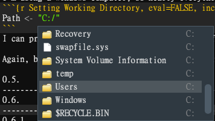
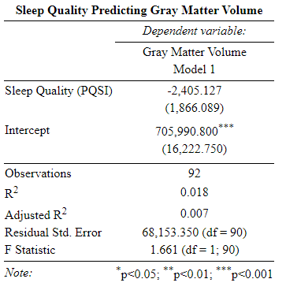

```{r, echo=FALSE}
knitr::opts_chunk$set(error = TRUE)
```

# Introduction

I must have tried to start coding half a dozen times before I actually was able to retain anything for longer than a couple of hours. That's because I was learning for the sake of learning and didn't have much of a scaffolding or context in which to place this knowledge for it to make any sense. If I had a specific thing I wanted to solve or a target I was working towards (kind of like what we're doing in this bootcamp), it probably would have been much easier. As such, I think it's really important early on to ***code towards a goal***. Luckily, R can be a pretty goal-focused tool. It's a language built specifically for statistical analysis (though it has sprawled to be useful for nearly everything else, too). We can use it to answer questions like, *Are there differences between Group A and Group B?* or *Does Variable A correlate with Variable B?*. You've already gotten familiar with a terminal in Day 1, and you also saw some data wrangling techniques in Day 2. Though we could certainly do much of the same things in R, we're going to heavily focus today on where R shines: conducting statistical analyses and visualizing that data. By the end of the day today, we're specifically going to answer:  
  
  1.) Are there sex differences in which participants have complete MRI data?  
  2.) Do we find sex differences in gray matter volume?  
  3.) Do we find any association between age and gray matter volume?  
  4.) Does sleep quality predict gray matter volume?   
    
We're going to breeze over some of the statistical theory because we don't have all the time in the world, but even without a solid statistical background, you should nonetheless be able to follow along in practice. This **is not** an exercise in statistical knowledge; it **is** an exercise in coding, but the content just happens to be statistical. 


## Opening A New Markdown File

First things first: if you haven't already done so, open R Studio. Then, you're going to want to open a new R Markdown document, by clicking *File > New File > R Markdown...*  


  
This should produce a dialogue box where you can enter the name of the script and your name before selecting **OK**.
  
  

Then, I'd recommend clearing out all of the default text that appears in a new R Markdown document, which I have highlighted below:  
  

## An *R Markdown* Primer 

Yesterday and the day before, we used a typical coding script, where every line only contained code that the language could interpret, even if what the code was interpretting was "ignore this line" as is the case with hash marks (#). In order to leave ourselves any notes, we had to use hash marks, and all of the output from our script either appeared in the terminal or in a separate window, as was the case for Spyder. A ***Markdown script*** does the same things as a typical coding script, but it gets a little bit fancier.   
  
1. If we want to leave notes, we don't have to "comment it out". We can just write long-winded narration that can help others understand why we coded what we coded and what that code does. That's because...  
  
2. A typical script will interpret any text as a command, unless the text is otherwise marked by a hashtag (#). A markdown script only interprets things as code when we tell it to, and we tell it what is code by creating a *chunk*. *Chunks* are marked by three backticks (```) followed by a {r} and, on another line, three more backticks.  
  
A typical script can't make sense of this, though. We need to use markdown scripts to do it. You might be thinking, though, that manually denoting code from non-code seems like extra work, and it is a little bit, but it can also be a lot more convenient because ...  
  
3. The output of any given chunk will appear just below that chunk, rather than in the *R Studio Console Window* or *Spyder Console Window*. By output, we just mean the product, sum, or status of whatever calculation or item you are asking R to compute and show you.   
  
You can still check the console window if you like; the output will still be there, but you also have a record that centralizes all of the output into a single window and can be easy to follow along. That's because...
  
4. Markdown grants us greater control over what we see and when we see it. To demonstrate, let's start by creating a new chunk in our markdown document and entering what we see in the image above, you can then follow along with the next bit:  

```{r}
2 + 4
```
With a typical script, if we want to know the output of a line we ran awhile ago, we either have to rerun it or scroll through the console to find it. With Markdown we can minimize entire chunks and their output by using the minimization button [  ] on the left side of the window. If we want to hide output, we can use the expand/collapse button [  ] on the right side of the output window  We can choose exactly what we want to run using the the "*Run*" command [  ] in the upper right corner of the chunk. If you want to export the output, whatever it may be, to a new window, simply click the first icon of the the three in the upper right corner of the output box [  ], and to delete, press the third [  ]. Note that deleting the output does not affect the related code.
Also of note, the down-facing arrow (second icon in the upper right corner of the code block) will tell R "Run all of the blocks of command that I have before this block" [  ]. It can be helpful if you make a mistake and don't want to manually rerun all of the previous blocks one by one to get back to where you were. It also makes your code very easy for other people to run. They can quite literally do it with the click of a button! If we click the cog icon in the same tray, we can access the output options and manipulate where output appears and what it looks like, but that's beyond the scope of this review [  ].
  
5. Science is all about replicability and sharing information. As such, it's super important that others can not only come to the same conclusions, but also undertstand how we came to those conclusions in the first place. Using an *R Markdown* script will allow us, once we are done, to compile all of our work, or "knit" it, into an interactive .pdf or .html document which others can follow. For an example, look no further than the .html files you all have been reading over the past couple of days! They are very helpful if you want to run a stat coding blog, document your analytic process for peer reviewers, or, say, teach a workshop on how to code in R.   
Now that we've got that out of the way, let's get started!  
  
## What's a "Package"?
  
Packages in R are synonymous with libraries in other languages. They are more or less convenient short-cuts or functions someone else already programmed to save us some work. Somebody else already figured out a very quick way to compute a regression so now we don't have to! We just use their tools to do it.   
  
Every new package is centralized in R's repository, so even though thousands of people are working on these things independently, you don't need to leave R to find them. Before they can be used, they must be installed, and you can do that pretty simply:
```{r Installing a package, eval=FALSE,include=TRUE, message=FALSE, warning=FALSE, error=FALSE}
  install.packages("PACKAGENAME")
```
  
Hopefully you've already done this, though. If need to update a package, you can just rerun the above code. If you're using *R Studio*, you can also see a list of your packages and their associated descriptions in the 'Packages' Tab of your *Viewer Window*.   

  

Now we've installed a package, but that doesn't mean we can use it yet. We need to tell R "We want access to the functions this package has during this session by calling it with the *library()* command.
```{r Package Management, eval=FALSE,include=TRUE, message=FALSE, warning=FALSE, error=FALSE}
  library(PACKAGENAME)
```
Notice that we drop the quotation marks now. We just specify the (case-sensitive) package name and it let's R know we are planning on using that this session.   
  
You might be wondering why we need to take this extra step. Sometimes different packages use the same commands, so having more than one of those active at the same time could confuse R (When this does happen, R will usually tell you). Sometimes packages take up a lot of disk space, so having ***ALL*** of your packages initialized at once might leave your computer running extremely slow. It's the same for most languages.  
  
If we ever want to explore the functions contained within a package in conjunction with examples, we can either go to **[the R documentation website](https://www.rdocumentation.org/)** or type '??PackageName' into the *Console*, which will then populate the *Help Tab* of the *Viewer Window* with information on the package.   
   
### Exercise 1  
Load the following packages:    
  
naniar  
report  
skimr  
stargazer  
tidyverse    
  
**Don't forget!**: This is code, so if we're using a markdown script, it'll need to be entered into a *Chunk*.
  
```{r Exercise 1, code="'\n\n\n\n'", results=F}


  
```

```{r Exercise 1 - hidden, eval=T, include=F}
library(naniar)
library(report)
library(skimr) 
library(stargazer)
library(tidyverse)
```

[Click for solution](https://github.com/TU-Coding-Outreach-Group/intro-to-coding-2023/blob/main/R/solutions/ex1.r)

## Specifying Your Working Directory in R

Like any other language or program, R needs to be told where the data that we'd like to work with is located on our computer. It doesn't just know automatically. We'll probably have to tell it more than once where files are located, so we can create a new variable containing a filepath to make this process simple so we aren't writing it out multiple times. I'm using a Windows computer, so nearly everything is contained within my C:/ Drive. If I were on a Mac, I'd start with a forwardslash. If I wasn't sure of my path, R makes it relatively easy to find it. If I start by entering this:

```{r Setting Working Directory Example, eval=FALSE,include=TRUE, message=FALSE, warning=FALSE, error=FALSE}
# For Windows
Path <- "C:/"

# For Mac
Path <- "/"
``` 

I can press tab when my cursor is to the left of the slash to see a list of directories contained within my C:/ Drive. Here's an example of what you should see:  

  

Pressing tab again will enter into a directory, thus showing me the contents of that directory. From there, I can keep hitting tab until I get to the directory, or folder, that contains the files I want to work with. I can then save this filepath, which is just what we call a *string* (i.e., text containing not quantiative value), as an object named *Path*. We do so by placing the object on the left of an equal sign (=) or an arrow (<-) and the value that object is taking on the right side of it. 

```{r Setting Working Directory, eval=FALSE,include=TRUE, message=FALSE, warning=FALSE, error=FALSE}
# For Windows
Path <- "C:/Users/Administrator/Documents/Github/intro-to-coding-2023/data/"

# For Mac
Path <- "/Users/Administrator/Documents/Github/intro-to-coding-2023/data/"
``` 

```{r Actually Setting Working Directory, eval=TRUE,include=FALSE, message=FALSE, warning=FALSE, error=FALSE}
Path <- "C:/Users/Administrator/Documents/Github/intro-to-coding-2023/data/"
``` 

This format of assigning a value to an object is really important and we'll keep coming back to it throughout this tutorial. 

## What is a "dataframe"?

Before we load in the data, I want to highlight a little terminology. The data that R works with is always contained within what we call a ***'dataframe'***. You've likely heard this term in the past workshops. It's quite literally what it sounds like: a framework in which to situate your data. It contains many cells that are situated into columns (which have names) and rows (which may or may not have names). Think of an excel sheet, except instead of an effectively infinite void of blank columns and rows which you could scroll or write into at your convenience, in R and similar languages, we need to clearly denote the boundaries (how many columns and rows) the data is contained within. We do this whenever we create a dataframe from scratch, or we read in pre-existing data. Because this workshop builds on the previous ones, we don't need to do the former; we can just 'read in' pre-existing data.  

## How do I load data into R?

There are many ways to load data into R and they all depend upon what format the data is in. R can handle data from .csv, .xlsx, .txt, .html, .json, SPSS, Stata, SAS, among others. R also has it's own data format (.RDA, .Rdata). With the exception of .RDA, **.csv** is often the cleanest means of reading in data. We won't cover the other formats, but they are fairly exhaustively covered **[in this tutorial](https://www.datacamp.com/community/tutorials/r-data-import-tutorial?utm_source=adwords_ppc&utm_medium=cpc&utm_campaignid=1658343521&utm_adgroupid=63833880415&utm_device=c&utm_keyword=read%20data%20r&utm_matchtype=p&utm_network=g&utm_adpostion=&utm_creative=469789579368&utm_targetid=aud-1282405912307:kwd-310852066315&utm_loc_interest_ms=&utm_loc_physical_ms=9007325&gclid=CjwKCAiAhreNBhAYEiwAFGGKPMtu1kPxHthxAqUmD-b7URmA5pqBUlq6CBL7TcBncVf-VQfO_gDgnxoCq0sQAvD_BwE)**.   
  
In the most basic sense, we can load data like this:

```{r Loading dataframe, eval=TRUE,include=TRUE, message=FALSE, warning=FALSE, error=TRUE}
  setwd(Path)
  df <- read.csv(file = "r_data.csv")
```

The ```setwd()``` command accepts our Path variable and tells R where to look for our .csv file. The ```read.csv()``` command actually loads in the data. If done correctly, we should see our *Environment* populate with a dataframe labeled *df*.  
  
  

If you click on *df* in the environment, it will open in a new tab of your *Source Window* (The same window you are likely writing script in) where you can view it. However, we can also look at the data in our markdown file though by entering the ```head()``` command from base R, which will show us the first few lines:
```{r Looking at the basic dataframe, eval=TRUE,include=TRUE, message=FALSE, warning=FALSE, error=FALSE}
  head(df)
```


There's a few things that ```read.csv()``` assumes correctly right off the bat. The default settings assume that the first row contains header names, which is correct in this case, so we don't need to specify that. Behind the scenes, ```read.csv()``` assumes that the different columns are divided by commas, which is also true in this case. If it weren't the data would look totally jumbled. However, it's not able to tell that the first column is just index information. Right now, it's treating it as if it's regular, informative data like all the other rows. We can fix that with a simple command:

```{r Adding RowNames Argument, eval=TRUE,include=TRUE, message=FALSE, warning=FALSE, error=TRUE}
  setwd(Path)
  df <- read.csv(file = "r_data.csv",
                 row.names = 1)
  head(df)
```

Notice that these arguments are separated by commas. If we don't put commas between arguments contained within the same command, R won't run the command. Also notice that we can put each of these arguments on their own lines. This isn't necessary, but it makes the code easier to read. R is NOT sensitive to indentation like Python is, so this is truly just a stylistic preference, but one I'd recommend adopting. 

Running them on the same line yields the same output: 
```{r Ran on the Same Line, eval=TRUE,include=TRUE, message=FALSE, warning=FALSE, error=TRUE}
  setwd(Path)
  df <- read.csv(file = "r_data.csv", row.names = 1)
  head(df)
```

Digressions aside: Amazing! Now we have six columns of data, like we should. We might also notice that the first row of column *GM_Volume*, which is blank or missing data, was correctly identifed as ***NA*** or *Not Available*. This is very important because R treats ***NA*** values as categorically distinct from other types of value, and we want those to be correctly identified, so we don't need to worry about that either. However, there's just one more thing we can specify that will save us a headache later. You might notice that Age is classified as a "Character" type, however, we want it classified as a "Factor", which would suggest that it contains non-numeric values that can be organized in a logical order. The *stringsAsFactors argument can take care of that.

```{r Adding stringsAsFactors, eval=TRUE,include=TRUE, message=FALSE, warning=FALSE, error=TRUE}
  setwd(Path)
  df <- read.csv(file = "r_data.csv", 
                 row.names = 1,
                 stringsAsFactors = TRUE)
  head(df)
```

Although we're only using a few arguments, we could customize this command much more by adding more arguments. If you ever want to see a list of arguments that a command can understand, you can either: 

  1.) Type the command name into the *Console* or *Source Window* script, press Tab within the parentheses and  
      use the arrow keys to navigate the subsequent dropdown menu that appears.  
  2.) Enter ?CommandName in the *Console* and read documentation on it in the *Viewer Window*.   

Option 1 is more convenient and probably a better choice for a command you are already familiar with. Option 2 is more exhaustive and great for a command you are still trying to understand.


### Exercise 2

```read.csv()``` contains a logical argument, which "if TRUE will check the names of the variables in the data frame to ensure that they are syntactically valid variable names. If necessary they are adjusted so that they are, and also to ensure that there are no duplicates."  Using one of the two methods highlighted above, find what that argument is and rewrite the data-reading command with that argument included.

```{r Exercise 2, code="'\n\n\n\n'", results=F}

  
```

[Click for solution](https://github.com/TU-Coding-Outreach-Group/intro-to-coding-2023/blob/main/R/solutions/ex2.r)

## Subsetting Data 

We already saw that we aren't starting with a perfect dataset: some of the data is missing! Sometimes, this isn't such a bad thing, but we really need to know what data is missing and how it affects our analyses. The ```gg_miss_var()``` function from the *naniar* package tells us that information:

```{r Examining Missing Variables, eval=TRUE, warning=TRUE, message=TRUE,include=TRUE, error=TRUE}
gg_miss_var(df)
```

In our case, we can see the only missing data that we seem to have is gray matter volume for eight participants, which isn't bad. If we wanted to analyze our data, though, we might want to create a *subset* of it, or a dataframe excluding this participants. There's a million ways to do this in R. We're going to start with the easiest to follow using the ```subset()``` function though:

```{r Using Subset}
df_sub <- subset(df,
                 !is.na(df$GM_Volume))
```

This looks kind of similar to ```write.csv()```. We have our command on the outside of the parentheses. We have the object that we're targeting (df). We have it followed by a comma. Our second argument is where things get a little tricky, so let's break it down, but let's hope around a little bit. First, note that we see our dataframe name followed by a dollar sign followed by the column name that we know has missing data. If we want to call or target a specific column in R, this is how we do it. That object (df$GM_Volume) is the only argument in another command, ```is.na()```. What ```is.na()``` does is identify whether or not a given value has a value of *NA* (remember, I said R treats NA values as categorically distinct!). 

So, it will look through the whole column df$GM_Volume and identify which values are NAs and which aren't. Placed where it is, it would tell R "Keep all the rows that have an NA in this column, and throw out all the rest". However, there's a little catch because of the bang (!) placed before it: this actually tells R "Do the opposite of what follows". 

All together this command tells R to look through the GM_Volume column in the df data frame, get rid of any rows where the value of GM_Volume is NA, and then save that resulting dataframe as an object called df_sub. 

We can do this more concisely, though:
```{r Using indexing}
df_sub <- df[!is.na(df$GM_Volume),]
```

It looks different, but it does the same exact thing. Let me take a quick step back and talk about indexing in R, because that's what allows us to do that above. I already mentioned if we want to call a specific column in R, we can index it using it's name:
```{r Calling a Column By Name}
df$GM_Volume
```

If I want to see a specific row, let's say Row 2, within that column, I can add brackets and the number of that row behind it:
```{r Calling a Cell by Position and Name}
df$GM_Volume[2]
```

However, we can also index the column using it's relative position. Knowing that the GM_Volume column is the fifth column, I can do this:
```{r Calling a Column By Position}
df[,5]
```

When indexing a data frame using brackets, the first position refers to the row or rows and the second position refers to the column or columns. By leaving the first position blank, we're telling R "Show me all of the rows for column 5". 

If I wanted to only see the value of the 2nd row for that column, I could do this:
```{r Calling a Cell by Positions Only}
df[2,5]
```

So, going back to our new subset technique:
```{r Using indexing again}
df_sub <- df[!is.na(df$GM_Volume),]
```

What we're telling R by including that ```!is.na(df$GM_Volume)``` command in the first index position is for R to only include rows that meet this condition, and we just went over that condition above. By leaving the second position blank, after the comma, we're telling R "include all columns, though". 

## Conditional Statements

Let's say we wanted to only look at female participants, though. It's pretty simple to do. We'd just construct a *conditional statement*. ```!is.na(df$GM_Volume)``` is a conditional statement, but, like I said, R handles NA's categorically different from other values, so NA conditional statements look a little different than other conditional statements. Other conditional statements look pretty similarly to how they do in other languages in R.

```{r Conditional Example, include=TRUE, eval=FALSE}
df$X3T_Full_MR_Compl == FALSE
```

Notice the two equals signs (==). When two value operators (=, >, <, !) are placed next to each other in R, and many other languages, we aren't assigning a value to an object; we are *comparing* the values between two different objects. In this instance, using two equals signs, if the two values are equal, it would produce a TRUE value; if not, then a FALSE. This variable which can only take the value of either True or False is called a *boolean*. When we tell R to compare the value on the right with this specific column, what it is mechanically doing is iterating through each row within this column, comparing the column present, and noting whether the conditional is True or False. In this way, it's *very* similar to For Loops in other languages. 

So, if I wanted to know which participants had incomplete MRI data, I could enter this:
```{r Checking Which Participants have incomplete data}
df$X3T_Full_MR_Compl == FALSE
```

It produces an array of TRUEs and FALSEs of the same length as the rows in the dataframe, because each individual TRUE and FALSE is telling us whether each row in that column meets the condition we defined. If we see a TRUE in the first position, we know that the first participant does not have complete MRI data. If we see a FALSE in the second position, we know that the second participant does have complete MRI data. Again, ```!is.na(df$GM_Volume)``` is doing the same thing; just answering a different question. If we run it alone, the output looks really similar:
```{r IS.NA Output}
!is.na(df$GM_Volume)
```

So, we could theoretically plug just about any conditional statement in our subset approaches and subset the data as we wish:
```{r Subsetting MRI compliance}
# The nrow() command outputs how many rows the data frame has
# We're doing this to show that both approaches yield the same result

# Approach 1
df_compl <- df[df$X3T_Full_MR_Compl == FALSE,]
nrow(df_compl)

# Approach 2
df_female <- subset(df,
                 df$X3T_Full_MR_Compl == FALSE)
nrow(df_compl)
```

### Exercise 3
Let's create a subset of the data that only contains female participants:
```{r Subsetting Female Participants - Mistake}
df_female <- df[df$Gender == F,]
nrow(df_female)
```
  
Oh no! What happened? Figure out the mistake and recode the command correctly.

```{r Exercise 03, code="'\n\n\n\n'", results=F}


  
  
```

[Click for solution](https://github.com/TU-Coding-Outreach-Group/intro-to-coding-2023/blob/main/R/solutions/ex3.r)

## Slight Break Time 

That was a big lead up to the main event, but basically familiarity with R syntax and conventions is really important before we start conducting analyses in R. Hopefully you feel like you have a half-decent grasp on what the environment contains, how to use the console to enter commands, and where to look when you need help. We're now going to get into analyses. We're going to start relatively simple with analytic approaches that utilize qualitative, categorical variables as predictors and get progressively more advanced to analyses that use continuous, numeric, quantitative predictors. At this juncture, let me reward my captive audience with a cute seasonally-appropriate photo of my dog.


# Analyzing Data w/ Qualitative Independent Variables

To start, we're going to be looking at how to analyze data that includes categorical or qualitative variables. Hopefully, hearing terms like "*Categorical*" and "*Qualitative*" immediately brings back to memory a term I mentioned earlier: **factor**. As a reminder, factors are qualitative groupings which can often be ordered in a logical way. We're going to be showing you how to code a **[Chi Squares](https://www.jmp.com/en_us/statistics-knowledge-portal/chi-square-test.html)**, which has a categorical variable for both its dependent and independent variables. We'll then examine how to code **[T-Tests](https://www.statisticshowto.com/probability-and-statistics/t-test/)**, which look for statistically significant differences between two categorical groups in a quantiative outcome. Lastly, we'll look at **[ANOVAs](https://www.statisticshowto.com/probability-and-statistics/hypothesis-testing/anova/)**, which allow us to examine more than one group simultaneously. We'll work in a touch of data visualization as well using *ggplot2*. You don't need to know much about those tests; I'll try to explain enough for you to keep up, but if you want to read more statistical theory, click each of their names to follow the hyperlinks. 

## Chi-Square Tests

A Chi-Square Test can be used when both the predictor and outcome, or independent and dependent variables, respectively, are categorical. They involve checking if the frequencies in our outcome or dependent categories match what we would expect to see if there were no differences between our predictor or independent categories. For lack of a more interesting association, within the context of our data, we could ask a question like whether There are differences between males and females in MRI data completion. Though perhaps not inherently interesting, it would be really important to know if some underlying component of our study design was disproportionately affecting one sex's completion rate.

**QUESTION**: 
Do males and females differ in the rate of MRI data completion?

**HYPOTHESIS**:
I have no reason to expect differences so we'll hypothesize that there will be no statistically significant differences between the two.

**RELEVANT VARIABLES**: 
Dependent:      df$X3T_Full_MR_Compl (Factor)
Independent:    Gender (Factor)

**ANALYSIS**:
Chi-Square

There's a whole ton of assumptions and quality concerns we usually want to test before we run a test, which we covered in the [last intro to coding bootcamp we ran](https://github.com/TU-Coding-Outreach-Group/intro-to-coding-2021/blob/main/R/COG2021_RBootcamp.html), but we learned the hardway that we really don't have the time to review all this background information in just one day's review, so I'm going to skip that for now, but you can always use the hyperlink above if you want to look at it on your own time.

The actual statistical test coding is fairly simple. We note our x variable and our y variable and then run the command. We are saving it as an object *chi*. NOTE: I have an extra set of parentheses around the whole statement. This tells R "When you're done running this, print the output". I hadn't explicitly mentioned it previously, but if all you're doing is assigning a value to a specific object, R won't print what that object's value is unless you explicitly tell it to. Here, because of the parentheses, I'm explicitly telling it to.

```{r Chi Square Test}
  (chi <- chisq.test(x = df$Gender, 
                     y = df$X3T_Full_MR_Compl))
```

But because I've both asked it to print the result and saved it as an object, I can also call the exact same object later and see the results again.
```{r Calling Chi Square Test}
  chi
```

On the first line, we see the two variables we were comparing named. 
On the second line, we see our test statistic (X^2 value), our degrees of freedom, and our p-value. Because our p-value is greater than 0.05, we're going to say we do not find any statistically significant differences between males and females, which is great. Again, we ideally don't want patterns behind our missing or incomplete data.

This is by no means, necessary, but I always like to write my journal-ready summary statement within my code so I can quickly reference it in the future and remember how I had interpreted the results in the past. 

```{r Chi Square Results, eval=FALSE,include=TRUE}
A Pearson's Chi Squared test with Yates' continuity correction determined that males and females did not significantly differ in the frequency with which they failed to provide complete MRI data [x-squared = 0.215, df = 1, p > 0.05].
```

### Exercise 4
Let's run a second Chi Square Test, this time examining whether there were differences in the number of males and females between the ages of 22 and 30. This is *going to be a challenge* and there is more than one way to do it. Remember, age is also considered a factor. Don't be afraid to use Google.

```{r Exercise 04, code="'\n\n\n\n'", results=F}

  
  
```

[Click for solution](https://github.com/TU-Coding-Outreach-Group/intro-to-coding-2023/blob/main/R/solutions/ex4.r)

### Visualizing Chi Squares
While a Chi Square Test is great, verbalizing the relationship can only go so far to communicate how these variables are related. Where R really excels, relative to some other languages, is visualizing relationships. ***ggplot2*** is one powerful tool to build visually-pleasing graphics one layer at a time. 


This chunk below should probably look big and confusing, and that's fine for now. We're going to run it so we can see what the end product looks like. Then we're going to walk through these lines and I'll show you that it really looks much more intimidating than it is.

```{r Chi Square Plots}
   ggplot(data = df, aes(x = Gender, fill = X3T_Full_MR_Compl)) +
          geom_bar() +
          scale_x_discrete(labels = c("Female", "Male")) +
          scale_fill_discrete("Incomplete MRI Data", labels = c("Incomplete", "Complete")) +
          labs(title = "Incomplete MRI Data by Gender",
               x = "Gender",
               y ="Frequency") +
          theme_classic() 
```

As I'd mentioned, ggplot's are built in layers. The first layer consists strictly of the plane in which the data will eventually be plotted. By entering where the data is being pulled from and the x and y values, we can lay the essential dimensions, but it's still not something very useful.

```{r Layer 1}
   ggplot(data = df, aes(x = Gender, fill = X3T_Full_MR_Compl)) 
```

We can add new layers by adding a plus sign (+) to the end of the previous line. Think of this as similar to a comma; we don't necessarily have to move the next layer object to a new line, but it helps for readability. The next layer object is the *geom*. Geoms can be lines, bars, circles or whatever other shape you might imagine. They tell ggplot *how* the data should be plotted. In this case, we want a bar. By simply adding ```geom_bar()```, we see some massive changes to the plot. It's much more readable! 

```{r Layer 2}
   ggplot(data = df, aes(x = Gender, fill = X3T_Full_MR_Compl)) +
          geom_bar() 
```

However, the axis labels aren't very descriptive. There's no title. Someone who just happened upon this visualization wouldn't be able to make much sense of it. We can fix this by labeling the different scales. We'll start with the X axis. Because our variables aren't continuous, but discrete, we'll use the ```scale_x_discrete``` command. We're going to concatenate the labels we want to see in their respective order (notice above female is to the left and male to the right).

```{r Layer 3}
   ggplot(data = df, aes(x = Gender, fill = X3T_Full_MR_Compl)) +
          geom_bar() +
          scale_x_discrete(labels = c("Female", "Male"))
```

Next, we can make our fill variable, X3T_Full_MR_Compl, make a little more sense with basically the same argument. Notice the general trend in the commands is "scale_VARIABLENAME_VARIABLETYPE". So if we had a quantitative variable within ```ggplot(data = df, aes()``` called ```color = ```, we would use ```scale_color_continuous()``` to modify it. 

```{r Layer 4}
   ggplot(data = df, aes(x = Gender, fill = X3T_Full_MR_Compl)) +
          geom_bar() +
          scale_x_discrete(labels = c("Female", "Male")) +
          scale_fill_discrete("Incomplete MRI Data", labels = c("Incomplete", "Complete"))
```

Amazing! Now in layer 5, we are just adding more labels. "Frequency" describes the y axis better than count and we might want a label on the plot.  

```{r layer 5}
   ggplot(data = df, aes(x = Gender, fill = X3T_Full_MR_Compl)) +
          geom_bar() +
          scale_x_discrete(labels = c("Female", "Male")) +
          scale_fill_discrete("Incomplete MRI Data", labels = c("Incomplete", "Complete")) +
          labs(title = "Incomplete MRI Data by Gender",
               x = "Gender",
               y ="Frequency")
```

Lastly, it might be nice to get rid of that horrid gray background. This is where the family of ```theme()``` commands come in. We could apply a nice general pre-packaged theme like so: 

```{r layer 6 - classic}
   ggplot(data = df, aes(x = Gender, fill = X3T_Full_MR_Compl)) +
          geom_bar() +
          scale_x_discrete(labels = c("Female", "Male")) +
          scale_fill_discrete("Incomplete MRI Data", labels = c("Incomplete", "Complete")) +
          labs(title = "Incomplete MRI Data by Gender",
               x = "Gender",
               y ="Frequency") +
          theme_classic()
```

... or this ...

```{r Layer 6 - Minimal}
   ggplot(data = df, aes(x = Gender, fill = X3T_Full_MR_Compl)) +
          geom_bar() +
          scale_x_discrete(labels = c("Female", "Male")) +
          scale_fill_discrete("Incomplete MRI Data", labels = c("Incomplete", "Complete")) +
          labs(title = "Incomplete MRI Data by Gender",
               x = "Gender",
               y ="Frequency") +
          theme_minimal()
```

... or we can get really crazy and manually specify the size, position, font, and face of just about everything in the plot.

```{r layer 6 - classic with all the bells and whistles}
   ggplot(data = df, aes(x = Gender, fill = X3T_Full_MR_Compl)) +
          geom_bar() +
          scale_x_discrete(labels = c("Female", "Male")) +
          scale_fill_discrete("Incomplete MRI Data", labels = c("Incomplete", "Complete")) +
          labs(title = "Incomplete MRI Data by Gender",
               x = "Gender",
               y ="Frequency") +
          theme_classic() +
          theme(plot.title = element_text(face="bold", size=13, hjust = 0.5)) +
          theme(plot.subtitle = element_text(face = "italic", size = 10, hjust = 0.5)) +
          theme(plot.caption = element_text(face = "italic", size = 8, hjust = 0.0)) +
          theme(axis.title = element_text(size = 12)) +
          theme(axis.text.x = element_text(size = 14, color = "Black")) +
          theme(axis.text.y = element_text(size = 14, color = "Black"))
```

These same elements are going to be used over and over again no matter what type of data you are plotting. COG has dedicated a few workshops to visualizing data in R, including the basic setup, and more advanced visualizations that animate, react, and become interactive, so if you're really interested in learning more, I'd recommend looking at the resources from our [2021 Workshop](https://github.com/TU-Coding-Outreach-Group/cog_summer_workshops_2021/tree/main/data-visualization-in-r) and our [2022 Workshop](https://github.com/TU-Coding-Outreach-Group/cog_summer_workshops_2022/tree/main/data-visualization-in-r). 

### Exercise 5
Let's try to generate a plot for the test we can in exercise 6. Remember, we want to see Gender on the x axis and the frequency of the age groups on the Y axis. There are also at least two ways to go about this. 

```{r Exercise 05, code="'\n\n\n\n'", results=F}

  
  
```

[Click for solution](https://github.com/TU-Coding-Outreach-Group/intro-to-coding-2023/blob/main/R/solutions/ex5.r)

## T-Tests

A T-Test can be used when both the predictor variable consists of two categorical options and the outcome or dependent variable is numeric in value. A T-Test tells you how significant the differences between these categories or groups are. In other words, it lets you know if the differences between the means of two groups could have observed by chance. We could imagine a situation where an evil teacher told half of the class before a test the right chapter to study from and told the other half of the class the wrong chapter to study from. The two categories or groups might be Right Chapter and Wrong Chapter and the outcome variable would be Test Score. Using a T-Test, we could determine whether studying from the right materials produces higher test scores. Within the context of our data, we could ask a question like whether males and females demonstrate significant differences in the volume of gray matter they possess. 

**QUESTION**: 
Do males and females differ significantly in gray matter volume?

**HYPOTHESIS**:
I'm an absolute idiot when it comes to structural neuroscience knowledge so I don't really know what we might expect to find. A real pea-brain hypothesis might be "On average, men will have greater gray matter volume, simply because they likely have larger brains to fit in their larger heads". 

**RELEVANT VARIABLES**: 
Dependent:      GM_Volume (numeric)
Independent:    Gender (Factor)

**ANALYSIS**:
Two-Sample T-Test

We are again going to skip over a lot of assumption testing, but I do want to take a moment to show off one of the most helpful functions I've found for this purpose. The ```skim()``` function from the *skimr* package gives us a lot of information in small amount of space. We could run it on our entire dataset, or just a few variables. Since we don't have that much, let's run the whole thing and look at the output. 

```{r Skimr Summary}
skim(df$GM_Volume)
```
It looks far less impressive than it typically does with so few variables, but we quickly get to see the structure of all of our data, the number of missing values for each variable, the mean value, a small histogram of the distribution of that variable, the interquartile ranges, frequency of factors, etc. It'll often replace several other functions for me. Again, though, because this isn't a statistics course, I don't want to get too into the weeds. 

### Okay, Now T-Tests

Okay, assuming that we've met our assumptions and decided that a t-test is an appropriate means of measuring our question, let's run the actual t-test. It's a little more complicated than our initial chi-square test, but maybe simpler than the chi-square exercise. We need to use conditional statements again to specify our variables. What we are comparing here are the mean values of gray matter volume for males and females. As such, we are going to specify we want to see gray matter when Gender == M and when Gender == F. We next have an argument which asks us whether this study is a within-subjects or a between-subjects design. This question is between-subjects, since each participant is either male or female for this study, so we mark that as FALSE. Lastly, R is asking us to define our alternative hypothesis, which is a little beyond the scope of this review, so you will have to take my word that "two.sided" is the right call. Lastly, when we look at T-Tests, standard deviations are very important, but the *t.test()* function won't automatically generate those. We are using the *sd()* function to capture the standard deviation of reaction action, and we're adding the argument (*na.rm*) that tells R to ignore any row that has a value of N/A.

```{r Two-Sample T Test}
  (ttest<- t.test(x = df$GM_Volume[df$Gender == "M"],
                 y = df$GM_Volume[df$Gender == "F"],
                 paired = FALSE,
                 alternative = "two.sided"))
  sd(df$GM_Volume, na.rm = T)
```

My pea-brain hypothesis panned out! We do see statistically significant differences, judging by that infinitely small p-value (t = 9.1271, df = 89.348, p-value = 1.985e-14). Now, like last time, we could write these results ourselves, but let's take a moment to pull out a nifty little tool from the *report* package (that unfortunately doesn't work with chi-squares or we would have used it earlier). ```report()``` will save us the trouble and summarize the results of our test (albeit a little imperfectly) for us.

```{r Report Function in R}
report(ttest)
```

Again, not necessarily formatted in a way that's ready for publication, but it automatically compiles a lot of the relevant statistics in a way that saves you a little bit of coding and effort. 

#### Exercise 6
I'm curious whether there are differences in gray matter between our second oldest and youngest age groups as well (I'd normally do oldest and youngest, but we don't have enough observations from 36+ people to run the test!). Run another t-test to test this out and try to interpret the output yourself. You can run ```report()``` to try to see whether your interpretation matches.

```{r Exercise 06, code="'\n\n\n\n'", results=F}

  
  
```  

[Click for solution](https://github.com/TU-Coding-Outreach-Group/intro-to-coding-2023/blob/main/R/solutions/ex6.r)

## ANOVAs

An ANOVA, or Analysis of Variance, can be used when both the predictor variable or variables consist of two or more categorical options and the outcome or dependent variable is numeric in value. Much like a T-Test, ANOVA tells you how significant the differences between these categories or groups are. The advantage over T-tests is that we can compare multiple groups or categories in one analysis. We could  revisit our last horrible example and imagine that the evil teacher tells one group right chapter to study from, one group the wrong chapter to study from, and one group to not study at all. An ANOVA test will tell us whether any of these three groups are different from one another (but not necessarily which specific groups are different from one another). Within the context of our data, we could use this type of test to determine whether there are any age related differences in gray matter volume (spoiler alert: We they were only trending statistically significance in the last exercise). 

**QUESTION**: 
Are there differences in gray matter volume by age group?

**HYPOTHESIS**:
Differences will exist in gray matter volume by age group.

**RELEVANT VARIABLES**: 
Dependent:      GM_Volume (numeric)
Independent:    Age (Factor)

**ANALYSIS**:
ANOVA

Pay close attention to the formatting of the syntax here. It is the standard way in which we specify most statistical models in R, whether for regression, ANOVA, hierarchical modeling etc.

```{r ANOVA Model}
  aov <- aov(GM_Volume ~ Age, data = df)
```

The *Base R* command we use to specify that this is an ANOVA model is *aov()*. We then place our outcome/criterion/dependent variable next, followed by a tilde (~). Following the tilde comes the predictor/independent variable(s). Once the model has been specified, we note its end with a comma and tell the model where the data exists. Now if we run this model, we'll see a new object by the name *aov*. But when we call that object...

```{r Calling AOV object}
  aov
```

... the information isn't really formatted in a way that's immediately meaningful or understandable. We typically look towards metrics like p values or means to understand ANOVA results and those are not present here. In order to see those, we need to *summarize* the ANOVA object. 

```{r ANOVA results}
  summary(aov)
``` 

Now we can see the variable we were exploring to the left with it's related degrees of freedom, sum of squares, mean square value, F vlaue, and p value to its right, respectively. The summary function uses the significance code at the bottom, so we see we again only find a relationship that trends significance. 

The report function works equally well on ANOVA objects as well. 

```{r Reporting the results}
  report(aov)
```

We can get a little crazier with our models though. What if we wanted to explore the main effects of age and sex on gray matter volume? We could respecify our model like this: 

```{r ANOVA Model With Multiple Variables}
  summary(aov(GM_Volume ~ Age + Gender, data = df))
```

All of a sudden, when we account for differences in gender, we begin to see a more pronounced main effect of Age! That's pretty interesting! Of course, we don't know which age groups are significantly different from one another, for that we need to code *contrasts* but that is well beyond the scope of this tutorial (maybe one day in the future; R currently doesn't have any good Bonferonni Contrast packages, as far as I know, so we're working on one). For now, though, let's talk about...

### Visualizing T-Tests and ANOVAs

At it's core, it's going to be pretty similar to Chi-Square tests. Let's just visualize the Age GM_Volume ANOVA results using a violin plot, which tells us what the distribution of data looks like, as well as the mean value. Notice, the only non-cosmetic (i.e., not title or variable) thing we're changing is the geom: we did away with the geom_bar and replace it with a geom_violin (we're also adding a trim argument to prevent it from extrapolating observations). To visualize the mean, we add a ```stat_summary``` command.

```{r ANOVA Visualization}
ggplot(df, aes(x = Age, y = GM_Volume)) +
    geom_violin(trim = TRUE) + 
    stat_summary(geom="point", fun = mean) +
    scale_x_discrete(labels = c("22-25 yrs", "26-30 yrs", "31-35 yrs", "36+ yrs")) +
    labs(title = "Differences in Gray Matter Volume by Age",
       subtitle = "",
       x ="Age Groups", 
       y ="Gray Matter Volume (units)") +
    theme_classic()
```


### Exercise 7

Notice the order of our commands above: what do you think would happen if you put stat_summary *before* geom_violin? Make a prediction, then try it out and see. When you finish that, make a visualization for our t-test (Gender differences in gray matter volume).

```{r Exercise 07,include=TRUE, eval=FALSE}


```  

[Click for solution](https://github.com/TU-Coding-Outreach-Group/intro-to-coding-2023/blob/main/R/solutions/ex7.r)

# Analyzing Data w/ Quantitative Independent Variables

We are nearly done for the day, but before we close up shop, we need to cover analyses that use quantitative, numeric predictors, probably most common of which is linear regression. Regression can come in many flavors, including **[bivariate linear regression](https://www.statisticshowto.com/bivariate-analysis/)**, multivariate linear regression, and **[binary logistic regression](https://www.statisticssolutions.com/binary-logistic-regression/#:~:text=Logistic%20regression%20is%20the%20statistical,%2C%20score%20%2C%20etc%E2%80%A6)**. Once again, I won't get too much into the theory, but hyperlinks are provided for those who want it. We will demonstrate some useful tools and syntax to get you prepared to use R on your own.  

## Bivariate Regression

A bivariate linear regression can be used when both the predictor variable (X) and outcome variable(Y) consist of continuous numeric values. A linear regression tells us how predictive of Y that X is. In other words, if we measured temperature and ice cream sales, we might find, using linear regression that as temperature increases, we could predict with decent accuracy that ice cream sales would increase as well, and we could predict how many ice cream sales we expect to see for any one value of temperature. Within the context of our data, we could ask a question like whether one's sleep quality affects their gray matter volume. 

**QUESTION**: 
Does sleep quality predict gray matter volume?

**HYPOTHESIS**:
As sleep quality increases, gray matter volume will increase.

**RELEVANT VARIABLES**: 
Dependent:      GM_Volume (numeric)
Independent:    PQSI_score (numeric)

**ANALYSIS**:
Bivariate Linear Regression

You're going to notice right off the bat that the structure of the syntax here looks awfully similar to what we just did in ANOVA. We start by noting our method with the *lm()* function (Linear Modeling). We then note our outcome variable, add a tilde (~), note our predictor(s), and finally note our datasource.

```{r Experimental Bivariate Model}
m1 <- lm(GM_Volume ~ PQSI_score, data = df)
```

Just like ANOVA, we need to use a *summary()* function to read the data.

```{r Bivariate Linear Model Summary}
summary(m1)
```

I find the output of summary to be easier to interpret for linear models than I do for ANOVAs, but it could still be cleaned up a little further using the stargazer package. The *stargazer()* function provides a much more audience-friendly way of sharing regression output that's easily exportable.

```{r Model Outputs}  
stargazer(m1, 
          type = "text", 
          title= "Sleep Quality Predicting Gray Matter Volume",
          column.labels = c("Model 1"),
          dep.var.labels = "Gray Matter Volume", 
          star.cutoffs = c(0.05, 0.01,0.001),
          covariate.labels = c("Sleep Quality (PQSI)", "Intercept"),
          notes = "",
          out = paste0(Path,"RegressionTable.html"))
```

We see that for every 1 unit increase in sleep quality, we can expect a 2,405.127 unit decrease in gray matter volume. However, because the standard error is so larger (1866.089), we cannot say that this relationship is statistically significant. Let me take a quick step back though and outline what I just did.

We start by specifying our model. If we have more than one, we can simply add them one after the other...

```{r Model Outputs Demonstration, eval=FALSE,include=TRUE}  
stargazer(m1, m2, m3, 
          type = "text", 
          ...
```

*Type* will modify how the table is constructed (I almost never have a reason to change this). We then can note various titles and labels and finally, where we want to export the table to. This of course is entirely optional; you do not need to export anything, but for the point of demonstration, let's try exporting it to our Path directory. To make it simple, I'm using the *paste0()* command which will concatenate multiple strings into a single string with no space between them (contrasted to the *paste()* function which allows you to use separators like underscores or hyphens between the strings). If we type that same command into our console, you'll see example what I mean.

```{r Demonstrating Paste0}
paste0(Path,"RegressionTable.html")
```

Now, outside of R, let's navigate to our respective directories and check that the regression table saved. Once you locate it and open the .html document, it should look like this.



Lastly, we can run the *report()* function for linear models as well! 

```{r Report for linear models}
report(m1)
```

### Exercise 8
Let's throw another big challenge at you all. We have not gone over creating visualizations for regressions, but, as I mentioned, a lot of ggplot syntax is the same, no matter what type of plot you want to create. In many ways, linear models are simpler to craft in ggplot. Try to visualize the model we just created. Make sure to talk to others and use all of the [resources](https://www.statology.org/ggplot2-linear-regression/) at your disposal if you get stuck (Google is your friend!). Make sure to save it as an object named "plot".

```{r Exercise 08, code="'\n\n\n\n'", results=F}
  
   
``` 


```{r Exercise 08 - hidden, eval=FALSE, include = F, warning=F, error=TRUE}
   (plot <- ggplot2::ggplot(df, aes(x = PQSI_score, y = GM_Volume)) +
                 geom_smooth(method="lm", alpha = .25, size = 1.5) +
                 labs(title = "Sleep Quality Does Not Significantly Predict Gray Matter Volume",
                      x = "PQSI Score", 
                      y ="Gray Matter Volume (units)") +
                 theme_classic())
``` 

[Click for solution](https://github.com/TU-Coding-Outreach-Group/intro-to-coding-2023/blob/main/R/solutions/ex8.r)

## Multivariate Regression

A multivariate linear regression builds upon bivariate regression by allowing for multiple predictors. If we measured temperature, ice cream sales, and the time since someone last ate, we might find that our previously specified model is now even more accurate because of the addition of the "time since last ate" variable. Within the context of our data, let's reexamine how the sleep quality of men and women affect gray matter volume. 

**QUESTION**: 
Does the interaction of sex and sleep quality predict gray matter volume?

**HYPOTHESIS**:
Another pea-brain hypothesis: men have more to gray matter volume to lose, so I predict sleep quality will disproportionately affect their gray matter volume more than women.

**RELEVANT VARIABLES**: 
Dependent:      GM_Volume (numeric)
Independent:    PQSI_score (numeric)
Independent:    Gender (factor)

**ANALYSIS**:
Multivariate Linear Regression

Once again, extremely similar to what we've already seen

```{r Experimental Multivariate Models}
  m2 <- lm(GM_Volume ~ Gender * PQSI_score, data = df)
  summary(m2)
```

Unfortunately, we did not support our hypothesis! Gender does not interact with sleep quality. We now have more than one model, so we're going to change our stargazer to reflect that. I've already demonstrated how to export a table, so we won't review that.

```{r Multivariate Model Output}  
stargazer(m1, m2, 
          type = "text", 
          title= "Predicting Gray Matter Volume",
          column.labels = c("Model 1"),
          dep.var.labels = "Gray Matter Volume", 
          star.cutoffs = c(0.05, 0.01,0.001),
          covariate.labels = c("Sex, Male", "Sleep Quality (PQSI)", "Male * PQSI", "Intercept"),
          notes = "")
```

## Exporting Visualizations 

One last function I want to highlight is how to export these plots. We could right click on a plot and 'Save Image' but the quality is usually atrocious. They are pixelated and disproportioned. My preferred method which produces beautiful quality, poster ready figures is to export the images as a pdf using the code below.

```{r Exporting Mean Emotion Plot}
  setwd(Path)
  pdf("Plot.pdf", width = 8, height = 4.5)
  plot
  dev.off()
```  


# Troubleshooting w/ Google

The last thing I want to highlight is that effective coding is not about memorization. If the internet disappeared and my scripts got erased, I'd be at a total loss to rewrite most of my R scripts, and that's okay. Coders have built robust communities that function as very valuable resources for any questions or issues that you run into. [StackOverflow](https://www.stackoverflow.com/) is a great general resource. Believe it or not, Google and Youtube are some others. Most of the problems I run into can be solved by a simple Google search, which often lead me to coding and stat blogs and vlogs I would have never encountered otherwise. It seems one of the absolute best skills you could develop is knowing how to search for solutions to your coding problems, and that comes with time and practice. 


# Closing

**Congrats!** You made it through an entire statistics coding bootcamp while potentially not really know any statistics! That's a herculean feat. Hopefully this was more *encouraging* than *discouraging*, but should you find yourself more on the discouraged side, don't hesitate to shoot me an email (billy.mitchell@temple.edu). Happy to help, and thanks for sticking with it.


