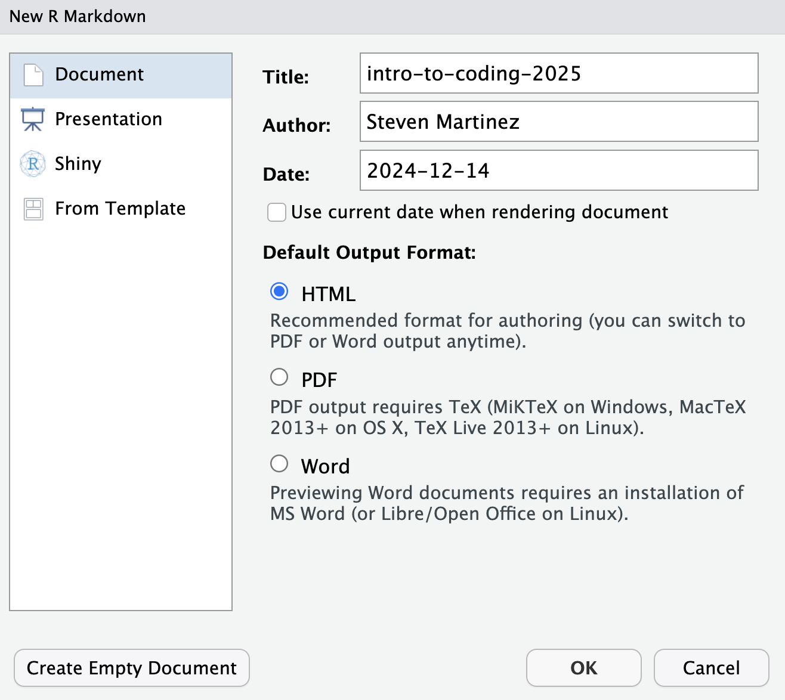
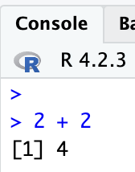
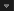
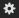
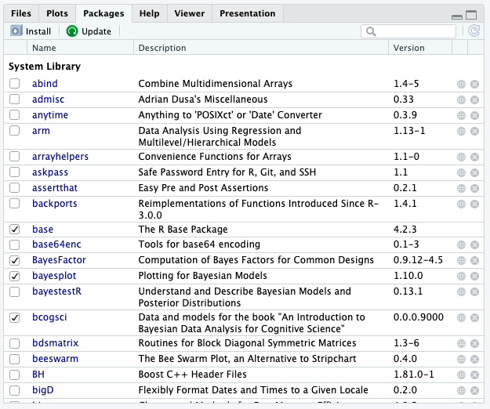
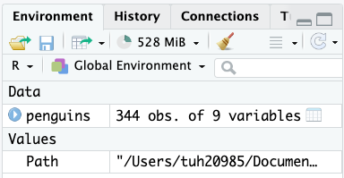

```{r, echo=FALSE}
knitr::opts_chunk$set(error = TRUE)
```


Set working directory for the purposes of this workshop
```{r, include=F}

here::here()

```
# Introduction

This workshop will provide an introduction to the programming language commonly referred to as R! 

R is a popular programming language that many researchers use for organizing data, visualizing data, and carrying out statistical analyses.

By the end of this workshop series, my hope is that you will feel comfortable enough to work independently in R!


```{r Intro Video, echo = FALSE}
vembedr::embed_url("https://www.youtube.com/watch?v=HluANRwPyNo")
```
[**What people think coding is versus what it actually is**]

# Are you ready to start learning R?

{width=70%}

# Pre-Workshop: Downloading R and RStudio Software 

Before the workshop, we'll need to download R and RStudio. Throughout the workshop, we'll be working in RStudio, which will allow us to write code in R. So let's make sure we have both R and RStudio installed before we begin!

1. Download a **R CRAN Mirror**, which basically just hosts the R programming language that we will be using in RStudio. https://cran.r-project.org/

2. Download **RStudio**, which is the main software that we will be using to work with R. https://posit.co/download/rstudio-desktop/

3. Download the **intro-to-coding-2025** folder from the TU-COG Github page (https://github.com/TU-Coding-Outreach-Group/intro-to-coding-2025) by pressing the green **Code** button and downloading the ZIP folder. This is the folder containing the all the files we will be working with for the purposes of this workshop.

4. Open up a new R Markdown document by clicking File > New File > R Markdown. **First time R users will be asked to download packages once they open up an R Markdown file. Click “Yes” to downloading those packages!**

{width=70%}


## Opening A New Markdown File

First things first: if you haven't already done so, open R Studio. Then, you're going to want to open a new R Markdown document, by clicking *File > New File > R Markdown...*  


  
This should produce a dialogue box where you can enter the name of the script and your name before selecting **OK**.
  
  

Next, let's clear out all of the default text that appears in a new R Markdown document, which I have highlighted below:

{width=70%}  


## Intro to R Markdown

In a typical coding script, every line must contain code that the language could interpret. If you want to include notes, you have to include a hash mark (#) before any code in order for the program to “ignore this line”, which can get a bit annoying. An R Markdown script is much more user friendly.

With R Markdown, any code that you would like R to interpret belongs in the coding chunk as illustrated below.

{width=35%}

If we want to leave notes, we don’t have to “comment it out”. We can just write long-winded narration that can help others understand why we coded what we coded and what that code does. 

That’s because a typical script will interpret any text as a command, unless the text is otherwise marked by a hashtag (#). An R markdown script only interprets things as code when we tell it to, and we tell it what is code by creating a chunk. Chunks are marked by three backticks (```) followed by a {r} and, on another line, three more backticks.

{width=35%}

The output of any given chunk will appear just below that chunk, rather than in the *R Studio Console Window*. By output, we just mean the product, sum, or status of whatever calculation or item you are asking R to compute and show you.   
  


R Markdown grants us greater control over what we see and when we see it. To demonstrate, let’s start by creating a new chunk in our markdown document and entering what we see in the image above, you can then follow along with the next bit:

```{r add 2 plus 2}

2 + 2

```

With a typical script, if we want to know the output of a line we ran awhile ago, we either have to rerun it or scroll through the console to find it. With Markdown we can minimize entire chunks and their output by using the minimization button [] on the left side of the window. 

If we want to hide output, we can use the expand/collapse button [] on the right side of the output window.

We can choose exactly what we want to run using the the "*Run*" command [] in the upper right corner of the chunk.

Also of note, the down-facing arrow (second icon in the upper right corner of the code block) will tell R "Run all of the blocks of command that I have before this block" []. It can be helpful if you make a mistake and don't want to manually rerun all of the previous blocks one by one to get back to where you were. It also makes your code very easy for other people to run. They can quite literally do it with the click of a button! 

If we click the cog icon in the same tray, we can access the output options and manipulate where output appears and what it looks like, but that's beyond the scope of this review [].


## Conceptual introduction to File Paths

"File paths" is just a fancy way to refer to the folders and subfolders that exist on someone's computer. Understanding how to navigate file paths is really important for being able to access specific files that you want to work with!

Here's an example of a file path: "/Users/tuh20985/Documents/GitHub/intro-to-coding-2025

Here's a visualization of what that file path looks like on a computer:


Each part of the file path is a separate folder that we are traversing through.

We'll revisit the concept of file paths when it's time to set our working directory and find the data that we will be working with as part of the workshop.

  
## What's a "Package"?

Packages in R are synonymous with libraries in other languages. They are more or less convenient short-cuts or functions someone else already programmed to save us some work. Somebody else already figured out a very quick way to compute a function so now we don’t have to! We just use their tools to do it.


## Installing packages
Every new package is centralized in R’s repository, so even though thousands of people are working on these things independently, you don’t need to leave R to find them. Before they can be used, they must be installed, and you can do that in a pretty way:

```{r install packages, eval = F}

install.packages("PACKAGENAME")

```

If you need to update a package, you can just re-run the above code. If you’re using R Studio, you can also see a list of your packages and their associated descriptions in the ‘Packages’ Tab of your Viewer Window.

{width=50%}


## Loading packages
Now we’ve installed a package, that doesn’t mean we can use it yet. We need to tell R “We want access to the functions this package has during this session" by calling it with the library() command.

```{r load package via library, eval = F}

library(PACKAGENAME)

```

Notice that we drop the quotation marks now. We just specify the (case-sensitive) package name and it lets R know we are planning on using that this session.

You might be wondering why we need to take this extra step. Sometimes different packages use the same commands, so having more than one of those active at the same time could confuse R (When this does happen, R will usually tell you). Sometimes packages take up a lot of disk space, so having ALL of your packages initialized at once might leave your computer running extremely slow. It’s the same for most languages.

If we ever want to explore the functions contained within a package in conjunction with examples, we can either go to the R documentation website or type ‘??PackageName’ into the Console, which will then populate the Help Tab of the Viewer Window with information on the package.

Let's try installing and loading in a few package for practice. Let's install and load the following packages in R: tidyverse, report, lme4, and ggplot2

## Week 1 Exercise: Installing and Loading Packages
```{r Week 1 Exercise, code="'\n\n\n\n'", results=F}


  
```


```{r Week 1 Exercise - hidden, eval=T, include=F}

install.packages("tidyverse")
install.packages("report")
install.packages("lme4")
install.packages("ggplot2")

library(tidyverse)
library(report)
library(lme4)
library(ggplot2)

```

[Click for solution](https://github.com/steventmartinez/CABLAB-R-Workshop-Series/blob/main/exercise_solutions/sol1.R)


## Introduction to palmerpenguins dataset 

For today's workshop, we'll be working with the palmerpenguins dataset.

The palmerpenguins data contains two datasets:

1) The **curated** data, which contains size measurements for 344 penguins from three penguin species observed on three islands in the Palmer Archipelago, Antarctica.

2) The **raw** data, which contains more information about the penguins


## Working Directory in R: What is a working directory?

In order to start working with the palmerpenguins datasets, we need to revisit the concept of "file paths" that we talked about earlier. We'll use our understanding of file paths to set our "working directory". At this point, some people may be wondering what a "working directory" is.

A working directory refers to the specific file path on your computer where R (or any programming language) will look for files by default. Like any other language or program, R needs to be told where the file that we’d like to work with is located on our computer. It doesn’t just know automatically. 

Below we'll use the getwd() command to check out where where my current working directory is.

```{r}

getwd() #get your current working directory

```

As you can see, my working directory is currently set at: "/Users/tuh20985/Documents/GitHub/intro-to-coding-2025"

The output probably doesn't make much sense to anyone because this working directory file path is specific to my computer! Each of our working directory file paths will be specific to the computer we are using.


## Working Directories in R: Specifying your Working Directory

In order to work with the palmerpenguins datasets, we need to tell R where the files are located. We can create a new object that stores a specific file path to make this process easier. File paths will differ based on whether you are using a Windows versus a Mac. 

If you're using a Windows computer, it's likely your file path will exist within your "C:/ Drive". 

If you're on a Mac, it's likely your file path will start with a forward slash "/". If you're not sure of your path, R makes it relatively easy to find it.

```{r Setting Working Directory Example, eval=FALSE,include=TRUE, message=FALSE, warning=FALSE, error=FALSE}
# For Windows
Path <- "C:/"

# For Mac
Path <- "/"
``` 


On my computer, here's where the palmerpenguins data exists:


In order to work with the penguins.csv file, I'll need to set my working directory to this file path!

Let's store this file path in an object called "Path".

```{r Setting Working Directory, eval=FALSE,include=TRUE, message=FALSE, warning=FALSE, error=FALSE}

# For Windows
Path <- "C:/Users/tuh20985/Documents/GitHub/intro-to-coding-2025/data/"

# For Mac
Path <- "/Users/tuh20985/Documents/GitHub/intro-to-coding-2025/data/"

```

```{r Actually Setting Working Directory, eval=TRUE,include=FALSE, message=FALSE, warning=FALSE, error=FALSE}
Path <- "/Users/tuh20985/Documents/GitHub/intro-to-coding-2025/data/"
``` 

This format of assigning a value to an object, like we did with **Path** and "/Users/tuh20985/Documents/GitHub/intro-to-coding-2025/data/" is really important and we'll keep coming back to it throughout this tutorial. 

We'll next use this **Path** object to set our working directory using the setwd() command. The setwd() command tells R where to look for our .csv file.

```{r, set working directory}

setwd(Path) #use the setwd() function to assign the "Path" object that we created earlier as the working directory

```

Amazing! Now that our working directory is set to the correct file path, we can start working with the data!


## What is a "data frame"?
Before we load in the palmerpenguins data, I want to highlight a little terminology. The data that R works with is always contained within what we call a ‘dataframe’. A dataframe represents the same thing that a spreadsheet represents in Excel. It contains many cells that are situated into columns (which have names) and rows (which may or may not have names). 

## How do I load data into R?
There are many ways to load data into R and they all depend upon what format the data is in. R can handle data from .csv, .xlsx, .txt, .html, .json, SPSS, Stata, SAS, among others. R also has it’s own data format (.RDA, .Rdata). With the exception of .RDA, .csv is often the cleanest means of reading in data. We won’t cover the other formats, but they are fairly exhaustively covered *<hyperlink/in this tutorial/>*. https://www.datacamp.com/tutorial/r-data-import-tutorial

Before reading in the palmerpenguins CSV file, we need to use the setwd() function to tell R where to look for our CSV file. 

Let's use the Path object that we created earlier to set our working directory to where the penguins.csv file is located on our computer.

In the most basic sense, we can load our penguins.csv data file using the read.csv() function like this:
```{r setting working directory}

penguins <- read.csv(file = "penguins.csv") #Load in the fright night practice csv file

```


The ```read.csv()``` command actually loads in the data. If done correctly, we should see our *Environment* populate with a dataframe labeled *penguins*. 


  
  

Since we're all using the same dataset, the number of observations and variables should be the same as in the picture above. Here, you can think of observations as "rows" and variables as "columns". If you click on *penguins* in the environment, it will open in a new tab of your *Source Window* (The same window you are likely writing script in) where you can view it. 

We can also view the penguins data frame by using the View() command.

If we want to look at the first few rows of the penguins data frame, we can use the head() command.

```{r eval = FALSE}

head(penguins) #will show you a subset of rows within the Data Frame
View(penguins) #will open up the full data frame like you would in Excel

```


Amazing! Now that we can see the penguins dataset, let's get a better idea of what each column represents

**species** column -- The three types of penguin species

**island** column -- The three types of island

**bill_length_mm** column -- A continuous number denoting bill length in millimeters

**bill_depth_mm** column -- An integer denoting bill depth in millimeters

**flipper_length_mm** column -- An integer denoting flipper length in millimeters

**body_mass_g** column -- A continuous number denoting body mass in grams

**sex** column -- Sex of the penguin

**year** column -- Year when the study took place


## Different data types in R

It's super important to recognize the different data types that exist in R. Some of the common data types include: character, factor, double/numeric, integer.

You may have noticed that for some variables, like bill_length_mm, we wrote "continuous number", whereas for other variables, like flipper_length_mm, we wrote "integer". This is because R uses different data types, which we'll talk about more below.

Let's use the glimpse() function from the tidyverse library to print out the data type for each column in the penguins data frame.

```{r, use glimpse}
glimpse(penguins)
```


Put simply, 

*dbl* references any number that reflects a continuous number and can include decimals.
*int* reflects integers, which only include whole numbers and do not include decimals.

We'll also include descriptions of the character and factor data types.

*chr* reflects character, which includes string-based text
*factor* reflects factor, which includes texts or numbers, but is typically used to reflect a category (Think "Low", "Medium", "High" for texts or "1", "2", "3", for rankings)


## Accessing rows and columns in a dataset


By looking at the penguins data frame, we can see that we aren’t working with a perfectly clean dataset: some of the rows have missing data! And we may not need all of the columns in the dataframe.

So how do we work with rows? How do we work with specific columns? And how can we check what data is missing? Learning how to access specific elements of a data frame is an extremely important part of learning R.

dataframe$column will print out all the rows in that column. Let's print out all the penguin species IDs that exist in the data frame.

```{r}

penguins$species 

```


What if we want to see a specific row? Let’s say row 2 within the *species* column? To reference a specific row in a given column, we can add brackets and the number of that row in the brackets:

The code below will print out the second row in the species column. We can manually confirm this by opening up the penguins data frame and looking at the second row in the species column.

```{r}

penguins$species[2]


```


However, we can also index the column using it’s relative position. Knowing that the species column is the first column, I can use bracket notation. Bracket notation is super helpful once you understand its structure. It helps me to think of it as [rows, columns]. Any number that appears before the comma will access rows, and any number that appears after the comma will access columns.

By including the name of the data frame before the bracket notation, we can pull certain rows and columns from that data frame

```{r}

penguins[1,] # print the first row across all 8 columns
penguins[,2] # print all the rows for column 2
penguins[1,2] # print the first row in column 2


```


Now that we know how to access rows and columns, let's move onto subsetting! 

## Introduction to Subsetting

Subsetting is a technique for filtering rows or columns in a given data frame in order to remove any rows/columns you are not interested in using.

# Subsetting rows 

We can subset rows and columns, but let's start off with focusing on how we can subset specific rows.

We know that there are three penguin islands: Biscoe, Dream or Torgersen

Let's say we only wanted to focus on penguins that were on the Biscoe island.

Thankfully, the filter() function from the *tidyverse* library makes subsetting a bit easier. Here, we will use the filter() function to subset the rows that represent penguins that existed on Biscoe island and store these rows in a new data frame called "penguins_biscoe".

```{r, subsetting rows}

penguins_biscoe <- penguins %>%
  filter(island == "Biscoe")

```

If you open up the penguins_biscoe dataframe using View(penguins_biscoe) or manually clicking on the new data object in the R environment window, you should see that all the rows in the **island** column of this data frame reflect the Biscoe island.
 
Let's break down 2 operators here that are particularly important.

*%>%* refers to piping, which lets you pass the result of one function directly as the input to the next function. Here, all we are doing is feeding in the penguins data frame into the filter() function.

Notice the two equals signs (*==*) in this part of the code: filter(island == "Biscoe")

When two value operators (=, >, <, !) are placed next to each other in R, and many other languages, we aren’t assigning a value to an object; we are comparing the values between two different objects. In this instance, using two equals signs, if the two values are equal, it would produce a TRUE value; if not, then a FALSE. This variable which can only take the value of either TRUE or FALSE is called a boolean. When we tell R to compare the value on the right with this specific column, what it is mechanically doing is iterating through each row within this column, comparing the column value, and determining whether the condition is TRUE or FALSE.

We can use this same strategy, piping (%>%) and value operators (==), to subset columns as well.


# Subsetting columns 

Let's say we weren't really interested in examining the depth of penguins' bills.

We can use the select() function from the tidyverse library to subset all the columns EXCEPT the "bill_depth_mm" column. In other words, by typing in all of the columns and leaving bill_depth_mm out of the code, we are essentially leaving this column out of the new data frame.

Here, we will use the select() function to subset all of the columns except the "bill_depth_mm" column and store these columns in a new data frame called "penguins_no_bill".

```{r, subsetting columns}

penguins_no_bill <- penguins %>%
  select(species, island, bill_length_mm, flipper_length_mm, body_mass_g, sex, year)

```

If you open up the penguins_no_bill dataframe using View(penguins_no_bill) or manually clicking on the new data object in the R environment window, you should see that all the columns EXCEPT "bill_depth_mm" are there.


## Subsetting rows based on multiple conditions

What if, rather than subsetting based on one condition (i.e., rows that represent Biscoe island), we wanted to subset based on multiple conditions? 

We can take advantage of the OR ( **|** ) operator using the filter() function.

Let's say we were only interested in examining penguins that existed on Biscoe or Dream island, but not on Torgersen island.

We can use the **OR** operator to tell R to subset all rows where island is equal to "Biscoe" OR "Dream" and store it in a new data frame called "penguins_biscoe_dream".

```{r, OR operator}

penguins_biscoe_dream <- penguins %>%
  filter(island == "Biscoe" | island == "Dream")
```

If you open up the penguins_biscoe_dream data frame, you can see that all the rows in the island column represent *Biscoe* or *Dream* islands, but not *Torgersen* island.

We can also take advantage of the AND ( **&** ) operator using the filter() function.

Let's say we were only interested in examining penguins from the Adelie species and that existed on Biscoe island.

We can use the **AND** operator to tell R to subset all rows where species is equal to "Adelie" AND island is equal to "Biscoe" and store it in a new data frame called "penguins_adelie_biscoe".

```{r, OR operator}

penguins_adelie_biscoe <- penguins %>%
  filter(species == "Adelie" & island == "Biscoe")

```

If you open up the penguins_adelie_biscoe data frame, you can see that all the rows in the species column represent *Adelie* and all the rows in the island column represent *Biscoe*. 

As you can see, leveraging the OR ( **|** ) and AND ( **&** ) operators in conjunction with the filter() function can be especially powerful.


## Week 3 Exercise: Subsetting data

Let's try an exercise where we have to subset data!

**1)** Create a new data frame called "penguin_gentoo" and subset rows that represent penguins from the *Gentoo* species.


```{r Week 3 Exercise, code="'\n\n\n\n'", results=F}


  
```

```{r Week 3 Exercise - hidden, eval=T, include=F}

penguin_gentoo <- penguins %>%
  filter(species == "Gentoo")
```

[Click for solution](https://github.com/steventmartinez/CABLAB-R-Workshop-Series/blob/main/exercise_solutions/sol3.R)


## Missing data 

What if we wanted to see which rows had missing values (e.g., NA) or not? In other words, what if some penguins were missing information about their bill length?

Let's go back to our original penguins data frame.

We can use the is.na() function to determine which rows have missing values in the bill_length_mm column.

```{r}

is.na(penguins$bill_length_mm)

```

This will produce an array of TRUEs and FALSEs of the same length as the rows in the dataframe, because each TRUE and FALSE is telling us whether each row in that column meets the condition we defined. 

For example, we see that the first output is FALSE, which means that the first row in the *bill_length_mm* column does NOT have a missing value. We can confirm this by opening up the penguins data frame and going to the first row in the *bill_length_mm* column and seeing that it is not empty.

However, we see that the 4th output is TRUE, which means that the fourth row in the *bill_length_mm* column DOES have a missing value. We can confirm this by opening up the penguins data frame and going to the fourth row in the *bill_length_mm* column and seeing that it is indeed missing.


But how can we remove missing data (i.e., rows that are blank or have an 'NA' in it) from a data frame?

We can use the drop_na() function from the tidyverse library to create a new data frame called "penguins_complete" that only includes rows with no missing values.

```{r}

penguins_complete <- penguins %>% drop_na()

```


What if, instead of removing rows that have a missing value in **ANY** column, we wanted to remove any rows that have a missing value in **ONE** column? We can again use the drop_na() function and specify the specific column that we want to remove rows with missing values from.

Let's create a new data framed called "penguins_bill_length_complete" that only includes rows with no missing values in the *bill_length_mm* column.

```{r}

penguins_bill_length_complete <- penguins %>% drop_na(bill_length_mm)

```

As you can see, the penguins_bill_length_complete represents rows that do not have a missing value in the *bill_length_mm* column. 


## If-else statements

An if-else statement is a powerful control flow tool that allows a computer to make decisions and execute different code paths based on specific conditions.

It works kind of like a fork in the road: if a certain condition is true, the progrram follows one path of code; if the condition is false, it follows an alternative code path 

It can be helpful to think of it as a digital version of decision-making -— "If it's raining, I'll take an umbrella; else, I'll leave without one.

Let's use an If-else statement to create a new column that represents whether an island existed in the Eastern or Western hemisphere of the world.

Let's say that the Biscoe island existed in the Eastern hemispehre, and the Dream and Torgersen islands existed in the Western hemisphere.

The structure for ifelse() statements is as follows: if the value in the *island* column has a cell that is equal to "Biscoe", R will insert a value of "Eastern" in the new *hemisphere* column for that cell, else, insert a value of "Western". 

We can use the mutate() function from the tidyverse to add the new "hemisphere" column to our penguins data frame.

```{r}

# Use mutate() with ifelse() to add a new column called "hemisphere" that reports the whether the island was located on the Eastern or Western hemisphere
penguins <- penguins %>%
  mutate(hemisphere = ifelse(penguins$island == "Biscoe", "Eastern", "Western"))

```


We can reconstruct the ifelse() function within the broader scope of what an If-else statement is actually doing, as shown below. This is similar to the fork analogy that we described earlier.

```{r eval = FALSE}

#General structure of if-else statement
if (condition) {
  expression
} else {
  expression
}

```


Here's what our code would look like within the general if-else expression

```{r eval = FALSE}

#General structure of if statement
if (penguins$island == "Biscoe") {
  penguins$hemisphere <- "Eastern"
} else {
  penguins$hemisphere <- "Western"
}

```


We can also use a for-loop to accomplish the same outcome that we had when using the mutate() function with ifelse() function.

A for-loop is one of the main control-flow constructs of the R programming language. It is used to iterate over a collection of objects, such as a vector, a list, a matrix, or a dataframe, and apply the same set of operations on each item of a given data structure. 


```{r introduction to For loop, eval = FALSE}

# -- For Loop general expression ---
for (i in 1:length(penguins$island)) {  
  if (penguins$island[i] == "Biscoe") {
      penguins$hemisphere[i] <- "Eastern"
  } else {
      penguins$hemisphere[i] <- "Western"
  }
}

```


Lets break this for-loop code down in some more detail.

**1)** for (i in 1:length(penguins$island)) { --- "i" is a temporary variable that store the values of the current position in the range of the for loop. In this case, we are telling R that we want "i" to represent each row within the length of the island column, starting at row 1 and going all the way down until the last row in the island column. "i" will iterate across each of these rows.

**2)** if (penguins$island[i] == "Biscoe") { --- This if statement is saying: if the value of i in the specific iteration of the island row is equal to "Biscoe". Think about it as "if the *first* cell in the island row is equal to "Biscoe", then if the *second* cell in the island row is equal to "Biscoe", then if the *third* cell in the island row is equal to "Biscoe", and so on..

**3)** penguins$hemisphere[i] <- "Eastern" --- input a value of "Eastern" into the corresponding cell of the new "hemisphere" column.

**4)** } else { --- the initiation of the else condition

**5)** penguins$hemisphere[i] <- "Western" -- input a value of "Western" into the corresponding cell of the new "hemisphere" column

