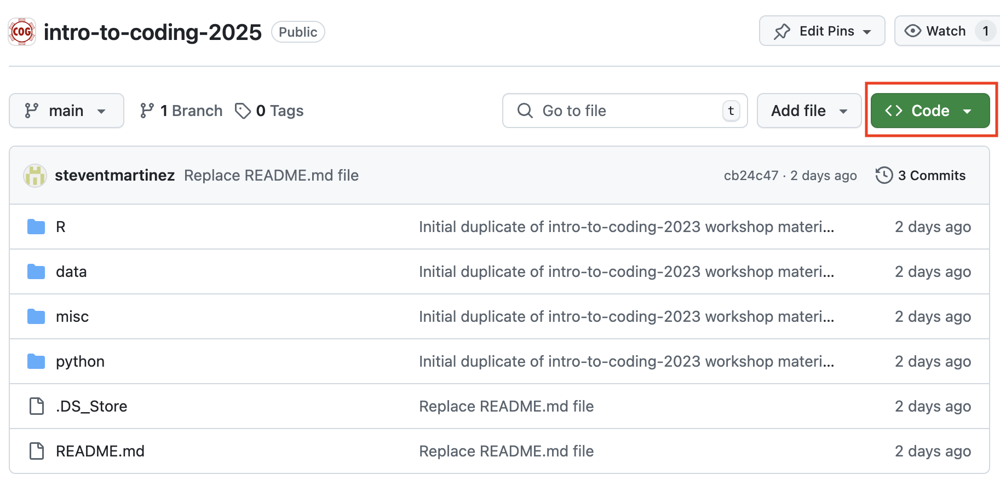

# Coding Outreach Group Bootcamp
# R Tutorial
12/17/2024  

__**Content Creators:**__ Steven Martinez & Helen Schmidt

## Description
This workshop will provide an introduction to the programming language commonly referred to as R! 

R is a popular programming language that many researchers use for organizing data, visualizing data, and carrying out statistical analyses.

By the end of this workshop series, our hope is that you will feel comfortable enough to work independently in R!

## To-do before the tutorial
1. **Download R**  
         Windows: https://cran.r-project.org/bin/windows/base/R-4.2.1-win.exe  
         Mac: https://cran.r-project.org/bin/macosx/         
         Linux: https://cran.r-project.org/
         
2. **Download RStudio** (which allows us to work with R, but is a different program from R)  
         Windows: https://download1.rstudio.org/desktop/windows/RStudio-2022.07.1-554.exe  
         Mac: https://download1.rstudio.org/desktop/macos/RStudio-2022.07.1-554.dmg  
         Linux: https://download1.rstudio.org/desktop/jammy/amd64/rstudio-2022.07.1-554-amd64.deb   

3. **Download the "intro-to-coding-2025"" folder from the TU-COG Github page (https://github.com/TU-Coding-Outreach-Group/intro-to-coding-2025)** by pressing the green **Code** button and downloading the ZIP folder. This is the folder containing all the files we will be working with for the purposes of this workshop.

## Tutorial objectives:
- Become familiar with RStudio and Rmarkdown (and more generally notebook style coding)
- Understand how to set a working directory and navigate file paths
- Learn how to load and clean data
- Conduct statistical analyses
- Learn how to visualize data

## Workshop Materials
- [Notebook Viewer](https://tu-coding-outreach-group.github.io/intro-to-coding-2025/R/index.html)