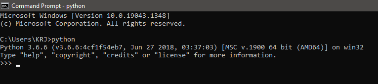
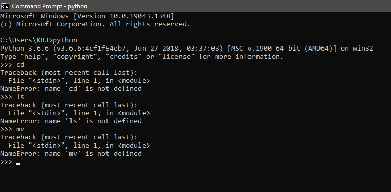
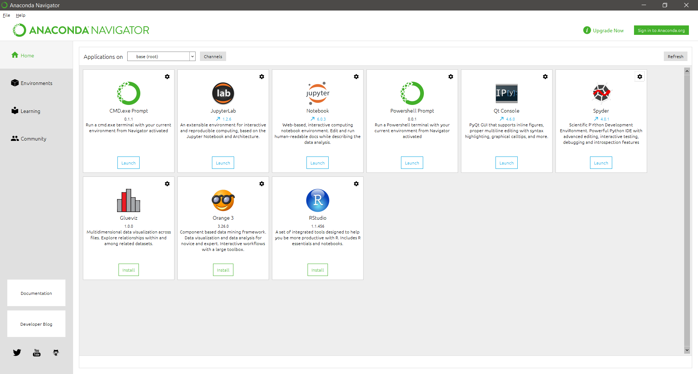
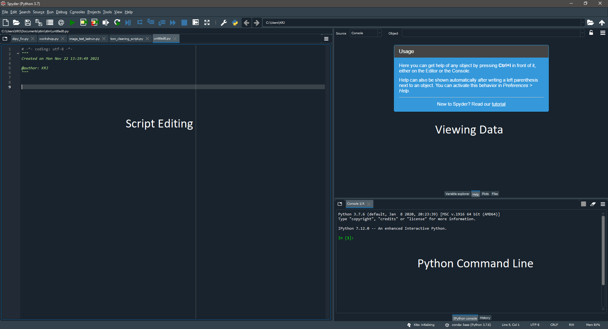
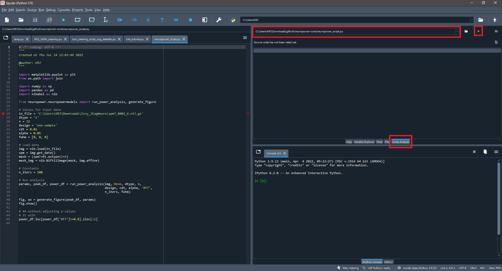
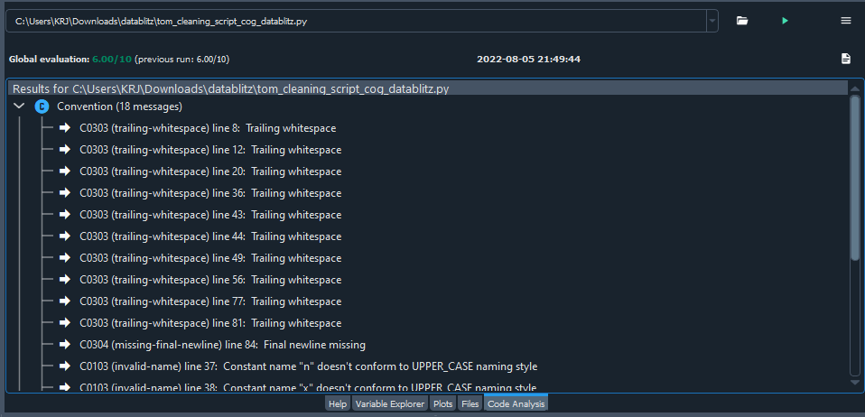
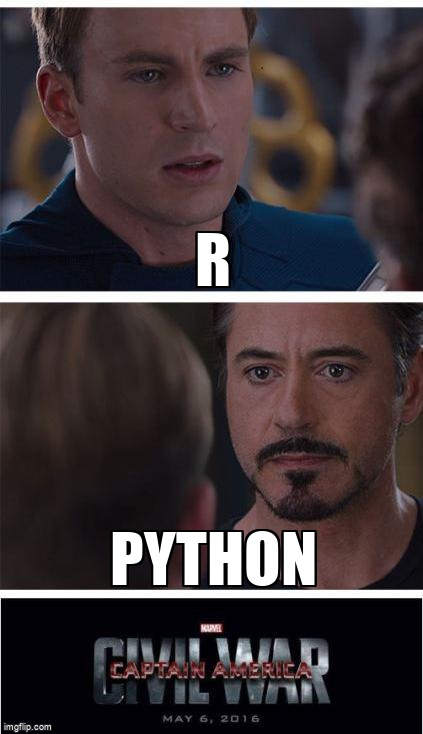

```{r eval=TRUE, echo=FALSE, include=FALSE}
knitr::opts_knit$set(root.dir = 'C:/Documents and Settings/wjpmi/Documents/GitHub/intro-to-coding-2023/python/images/')
```

Welcome to Day 2 of Coding Bootcamp!

Yesterday, you learned the basics of bash and how to navigate your data in the terminal. Today we will be using Python to clean that data and make it easier to use for analysis.

## Learning Objectives for Python

1.  Integrate what we know about bash into Python
2.  Learn how to clean data using Python packages

## Questions You Should be Able to Answer

1.  What is an IDE?
2.  What types of data can Python handle?
3.  What is a DataFrame?
4.  What is a software library?


# How to use Python (command line)

bash relies on using a terminal - Python also has a terminal that can be used in a similar way, but there are other options as well!

First, we will look at what it is like to use Python in a terminal.

For those using a Mac: just open up your regular terminal. For those using a PC: type "cmd" into your computer's search bar.

Once you have your window open, you must initialize Python by typing:

```{python eval=FALSE}
python
```

OR

```{python eval=FALSE}
python3 #you can substitute the 3 here with any version of Python you want to call 
```



You should see information about what version of Python is currently in use, as well as the "\>\>\>" indicating you are using Python and not bash or any other command line language.

Note that you cannot use bash commands within the Python command line.



Sometimes, not having these commands make it more difficult to work with data. Othertimes, we want to remember which commands we ran or we want to run scripts on new data. So, we have alternatives to just using the command line.

# How to use Python (IDE)

## IDE's

What is an IDE? - integrated development environment

This is an application that makes it easier to write scripts, automate and troubleshoot.


"Anaconda is a distribution of the Python and R programming languages for scientific computing, that aims to simplify package management and deployment. The distribution includes data-science packages suitable for Windows, Linux, and macOS."

Basically an easy place to integrate all of your coding needs!

Within Anaconda, we have a few different IDE's that come with the program.




Jupyter notebooks is one form of IDE that can be used. The advantage to Jupyter notebooks is the ease of sharing with others. Once you have loaded your data and written your code, you can transform the page into an .html file that can be shared. Jupyter notebooks also uses R, so you can integrate your data cleaning and analysis all in one place!

If you are wondering what output from this IDE is like, look no further! This tutorial was built using Jupyter.


Spyder is another popular IDE that is used for Python. It integrates a command line, an editor, and other convenient functions. It mirrors RStudio in its format. This IDE is generally more useful if you are trying to develop code rather than present data. Sometimes data cleaning involves a more complicated script because of the way output is formatted.



## Exercise 0

Just like yesterday, let's get in the habit of copying commands we write as we go through the workshop. This time we'll be using the Spyder IDE. Open Anaconda, and then Spyder. Then, create a new file, name it "python_exercises.py". The ".py" extension tells our computer that it is a Python script. You should also specify that this is a python script by adding `#!/bin/python3` to the first line of the document.

Unlike in Visual Studio Code, in Spyder we can also practice running lines from our script which then execute from the Python Command Line. See if you can figure out how to run a single line of code from your "python_exercises.py" file.

# Intro to Coding in Python

Here we are going to talk about the place where coding and Python as a language overlap. There should be a lot of familiar concepts and ideas in this section. Think about the types of things you learned in our bash session, and try to apply some of those concepts here!

Some definitions:

*Object* - almost everything in Python that you will be working with can be called an "object". Python is object-oriented. You can also think of these objects as variables.

```{python}
x = 5
print(x)
```

Where x is our object!

*Data types* - much like the real world, data within Python can have different types. Our objects can hold many different dara types. Some data types that you could encounter within Python: 1. Text 2. Numeric 3. Sequence 4. Mapping 5. Set 6. Boolean 7. Binary

```{python}
type(x)
```

In this case, our object (called `x`) is an integer. This is a numeric data type, and therefore can be used in operations that can be used on numeric objects.

But numeric data is not the only type of data that can be used!

```{python}
y = "This is a string"
type(y)
```

A string allows the storage of variables that may not necessarily be numeric. This is considered a text data type in Python!

```{python}
t = [3,6,9,12,15,20]
type(t)
```

A list stores multiple data points within itself. This type of data is particularly common among those who do data manipulation within Python. This is an example of a sequence data type.

The most common data types you will encounter in this workshop are text, numeric and sequence. These are all also data types that are common among other coding languages, though not bash or R in this case.

### Exercise 1

Create two variables: one string and and numeric. Print both! Update the code below and save it to your script.

```{python eval=FALSE}
string = [ ]
numeric = [ ]
```

```{python eval=FALSE}
print( )
print( )
```

[Click for solution](https://github.com/TU-Coding-Outreach-Group/intro-to-coding-2023/blob/main/python/solutions/py_ex1.py)

## Operators in Python

Python provides a wide range of possibilities for what we can do with our data. Most of the time, it is pretty intuitive to figure out how to use them.

To manipulate data we are using something called an operator. An operator is a symbol that will carry out a specific function, such as a arithmetic or logical computation. They can be used on variables and values within Python.

An easy example of this is a simple mathematical computation:

```{python}
z = 1 + x
print(z)
```

```{python}
y = z * 4
print(y)
```

```{python}
w =  "This is" + " a string"
print(w)
```

Where the plus and multiplication signs are our arithmetic opertors! Our equal sign in this case is what we call an *assignment operator* - it assigns the value of the equation to the right of the equal sign, into the variable on the left. As you can see, we can even use these operators with different kinds of objects in Pythin, like strings!

Within an IDE, these operators will show up as a different color than other types of commands, so they should be easy to spot.

When thinking of how this can be applied to data cleaning, it can be helpful if you want to center your data, create a new variable out of existing ones, find the mean of a variable, etc.

There are also other types of operators which allow you to complete different functions. For a full list of operators and what they do, [this website](https://www.w3schools.com/python/python_operators.asp) has a comprehensive list of the ones you may encounter within Python.

### Exercise 2

Create a variable using mathmatical operators that, when printed, outputs 25! We've included some sample code below.

```{python eval=FALSE}
z =
print(z)
```

[Click for solution](https://github.com/TU-Coding-Outreach-Group/intro-to-coding-2023/blob/main/python/solutions/py_ex2.py)

## For Loops in Python

For loops in Python work a lot like for loops within bash. The same concept applies, though there are slight differences in the syntax of it all.

A quick refresher about for loops and their logic. We want to use for loops when we want our program to loop through a list of things. It can be used for a lot of different reasons; too many to even list here! You can use them in creative ways to help you automate tasks that you would otherwise do by hand.

Let's look at an example in Python.

```{python}
majors = ["computer science", "psychology", "neuroscience"]
for x in majors:
    print(x)
```

In this case, there are three text variables contained within our list variable, "majors". Our for loop says that for every variable contained within the list, it should print each one.

You do not necessarily need to use `x` to denote your variables in this case. You can use almost anything if it helps you make sense of your code later on:

```{python}
majors = ["computer science", "psychology", "neuroscience"]
for words in majors:
    print(words)
```

This should be reminicent of what you learned during the bash portion of the workshop. One difference between Python and bash is that you *need* to use a colon when setting up the for loop, and you do not need to close it by using "done". Another critical difference is that unlike in bash, in Python, **indentation matters**. See how we've indented after starting our for loop? In Python, indentation is a way of telling a Python interpreter that the group of statements belongs to a particular block of code.

You can also add what is called an "if statement". Sometimes, you want to run through all of your data, but you only want to retain some of it. The if statement tells the data to do something only if it meets a condition that you have set. For example, if you only wanted to print "psychology" as a major:

```{python}
for words in majors:
    if words == 'psychology':
        print(words)
```

For loops used in conjunction with if statements can be powerful tools in cleaning large datasets. By using something that can iterate through all of your data and extract what you need, it removes human error in data cleaning and makes it a much faster process! Note how we've indented the if statement within the for loop.

### Exercise 3

Edit the code below so it prints the names of our TA's today!

```{python eval=FALSE}
# HINT: Our names are Katie, Billy, Helen, and Steven
ta = ["", "", "", "", "", ""]
for  in  :
    print()
```

[Click for solution](https://github.com/TU-Coding-Outreach-Group/intro-to-coding-2023/blob/main/python/solutions/py_ex3.py)

## While Loops in Python

While loops are like for loops. They perform a similar function, which is to iterate through data based on parameters you set up. In my opinion, while loops are best when you don't know exactly when you need the loop to end. For example, in our for loop in the previous example, we knew how many majors were inside of our variable, so we knew that the for loop would run through all three majors.

In the example below, we have 20 datapoints. We only want to print the first 10 reaction times (trials 1-10). Let's see how we would do this with a while loop. We'll go over what the `import pandas as pd` line means a little later:

```{python}
import pandas as pd

data = {'trial' : [1, 2, 3, 4, 5, 6, 7, 8, 9, 10, 11, 12, 13, 14, 15, 16, 17, 18, 19, 20], 'rt' : [2.5, 4, 8.7, 1.2, 7.8, 3, 4.5, 6, 2, 2.3, 7.9, 1.2, 1.4, 5, 2.3, 4.1, 3, 4.7, 1.8, 2]}
df = pd.DataFrame(data=data)
```

```{python}
print(df)
```

```{python}
n = 0
while n < 10:
    print(df.iloc[n]['rt'])
    n += 1
```

For a while loop, you need a variable like n in the example above to iterate through the data, as opposed to iterating through the data using individual variables.

You can also use if statements within a while loop, just like a for loop.

### Exercise 4

Create a while loop (with an if statement if you want to get creative) that prints the last half of the reaction times in our dataframe `df`!

```{python eval=FALSE}
import pandas as pd

data = {'trial' : [1, 2, 3, 4, 5, 6, 7, 8, 9, 10, 11, 12, 13, 14, 15, 16, 17, 18, 19, 20], 'rt' : [2.5, 4, 8.7, 1.2, 7.8, 3, 4.5, 6, 2, 2.3, 7.9, 1.2, 1.4, 5, 2.3, 4.1, 3, 4.7, 1.8, 2]}
df = pd.DataFrame(data=data)

n =
while
    
    print()
```

[Click for solution](https://github.com/TU-Coding-Outreach-Group/intro-to-coding-2023/blob/main/python/solutions/py_ex4.py)

## Functions in Python

Sometimes when you are coding, you have something that you may want done many times. Rather than code this multiple times in multiple different places, you can create a function which will call a line of code. You can make a function as simple or complex as you would like, and the ability to pass different data into these functions can help shorten your code.

```{python}
def my_function():
    print("I pass butter")
    
my_function()

def my_instructions():
    print("Raise your hand if you need help!")
    
my_instructions()
```

As you can see, any time that you type my_function() after you define it, it will perform that line of code. This can be helpful if you need to do something to your data multiple times.

You can also make it so you can pass variables into these functions to do the same computation on different variables.

```{python}
iq_score = [100, 89, 72, 108, 120, 78, 86, 91, 95, 82]
happiness_rating = [0, 2, 7, 2, 8, 10, 9, 0, 5, 10]

def mean(fname):
    num_variable = len(fname)
    sum_variable = sum(fname)
    avg_variable = sum_variable/num_variable
    print("The average is:")
    print(avg_variable)
    
mean(iq_score)
mean(happiness_rating)
```

### Think!

Do some of these commands (like `len()`) look unfamiliar? How would you look up what they mean and what the command does?

## Indexing in Python

Something we need to understand before we start cleaning our data is indexing. Indexing is the way a program stores information, and it is important to understand how it works so you can call your data properly. Many coding languages use indexing.

Indexing is used to look at individual data points or individual rows and columns based on their location in a sequence. Python is a zero-indexed program, so things like lists start at 0, rather than 1. This means that when Python reads your data in, it will read your first data point in as 0. So, if you were to have 12 data points in your 'Reaction Time' column, then the first data point would be referenced as position 0, and your last data point would be referenced as 11. The easiest way to show this will be when we start working with the data.

Indexing is a way to refer to individual items within a Dataframe or list. Python is a language that uses objects that are "object-indexed". This means that the first variable is coded at position 0 (as opposed to position 1, as you would think of in normal logic). This is a common thing to see in coding languages.

```{python}
x = [12, 5, 6, 13, 14, 3, 9]
```

### Exercise 5

If we wanted to call the 3rd number in our list x (i.e. 6), what number would we put between the [] in our code? Test your answer out in spyder!

```{python eval=FALSE}
print(x[])
```

[Click for solution](https://github.com/TU-Coding-Outreach-Group/intro-to-coding-2023/blob/main/python/solutions/py_ex5.py)

## Indexing in Python (cont'd)

Indexing can be neat, as you can also index multiple rows or columns at a time if you need to. For instance:

```{python}
print(x[2:6])
```

This command says to print the third through the sixth item in our list. Note that the number on the right-hand side of the column indicates that it should print *up to but not including* the seventh item in the list.

You can also use something like this:

```{python}
print(x[:5])
```

This prints everything in this list starting at x[0] and up to x[5].

# Data Manipulation in Python

Now we are going to put all of our knowledge about Python together to clean a behavioral dataset that we have. In my opinion, the best way to show you all how to use Python to clean your dataset, is to use a real dataset!

We will be using data from the Human Connectome Project dataset, which we will talk more in depth about in a little bit.

The first thing we will need to do is read our data into a format that Python can work with.

## Libraries

In order to do this, we need to use something called a software library. A library holds different commands and tools one can use, that are generally developed by people in an open source manner.

There is what is called the base Python library, which is automatically loaded and you are able to use it without calling a specific library. It has many convenient functions. But sometimes you want a more specific library that has the functions that cater to your needs.

The library we are going to use to load in our data is called Pandas. This library is specifically aimed at data manipulation and analysis, so it's a library you will encounter often.

To import Pandas, type:

```{python}
import pandas
```

This command is the most basic way of calling a library within Python. It calls the entire library and nothing else. There is one other way to do this though:

```{python}
import pandas as pd
```

The reason for the "as pd" portion of this command is to name our library something that is easy to be called on. In theory, you can call *Pandas* as whatever you would like. However, many people denote *Pandas* as pd, and if you are sharing your scripts with others, it would be beneficial to keep this consistent in your scripts.

If you wanted to call one specific function from Pandas, you can also do that. Sometimes this is good for neuroimaging libraries (like `nltools`) because the libraries take a long time to load. This is not necessary for us, but just to show you an example:

```{python eval=FALSE}
from pandas import Series
```

We will be using more libraries as we move along, so I will be sure to point these out for you. If you are not sure of what library you might need for a function you would like to perform, [PySearch](pysearch.com) can be an easy tool to use! Now that we will be working with real data, let's talk about how we can load data in Python.

Unlike both bash and R, there isn't really a working directory with Python. Because you cannot move between directories, you must always use the full file path when calling any file within Python. This file path is going to change from person to person. Let's start by telling Python where the Introduction to Coding directory is on our computers. For me, it's here:

```{python}
path = "C:/Users/wjpmi/Documents/GitHub/intro-to-coding-2023/"
```

Make sure yours is wherever your `intro-to-coding-2023` directory is. Defining this path will save us time later, you'll see.

Pandas comes in handy here because something needs to take our input (in this case, the Human Connectome Project dataset) and enter that into a variable that Python can use. When we want to use a command within Pandas, there are two parts to it. First, you will call Pandas, but as pd (as we discussed above). You also must call the specific command you want. Our data is in CSV format, we want to use the 'read_csv' function that comes with Pandas. Putting it all together, it will look like this:

```{python}
df = pd.read_csv(path + 'data/unrestricted_kjobson_4_8_2022_11_19_20.csv')
```

Combining `path` and `'data/unrestricted_kjobson_4_8_2022_11_19_20.csv'` with the `+` creates a new string, denoting the full filepath to our .csv. We can check that string be entering:

```{python}
print(path + 'data/unrestricted_kjobson_4_8_2022_11_19_20.csv')
```

Libraries are often used in this format, where it is the *'library'.'function_to_perform'*. You can find a huge list of some of the things you can do in Pandas [here](https://pandas.pydata.org/docs/user_guide/10min.html#object-creation). There are commands to organize your data, select certain rows or columns, and even perform statistical functions to the data. We have used some of these already, and will continue to in the rest of the workshop!

# DataFrames

With this command, we are loading our first CSV file into our variable, called `df`. It is important to name your data something meaningful so that when you are coding a script, it is obvious to you which variable you are handling. As this file has a lot of data inside of it, this will be our main "DataFrame" (`df`). We will split this into smaller DataFrames to make it easier to work with.

As I just said, this `df` variable is now our DataFrame. This is exactly what you would imagine it to be - a 2D representation of our tabular data (Think of an excel spreadsheet). DataFrames can hold any type of data (text, numeric, sequence, etc). This is helpful because data is not always numeric.

Whatever your column and names are, Python will automatically bring those over from your data for you. So, it is important that the first row of your data are your variable names, so that you can easily find and manipulate the variables you want.

We can check our what is inside of our variable, and whether it was loaded correctly. We are only going to load a few of the columns here because there are 500+ columns in our CSV file, but you can print the whole variable like this:

```{python}
print(df)
```

You can print your DataFrame by a certain number of rows:

```{python}
df[:5]
```

Or, a certain number of columns:

```{python}
df.iloc[:, :5]
```

### Think!

What do you think this '.iloc' is, based upon what you have learned so far? What library could it be a part of? Sometimes it is also helpful to print out all of the header names, as it is usually easier to select columns by their name rather than the way we just did it:

```{python}
df.columns
#if you want Python to print all of the column names, you need to tell it to do so when there are this many
#you can override the default by using this command:
#pd.set_option('display.max_columns', None)
#then you can run the same command again - keep in mind, this is a global setting that changes it for everything!
```

```{python}
df['Subject']
```

These commands will give you information about header names, number of rows and columns, and other relevant information.

### Think!

What do the numbers 0-17 on the left-hand side of the data (from 'df[:5]' and df.iloc[:, :5]' represent? (Hint: we just talked about how Python labels our data!)

Now that we know how to look at the data as a whole, we can look at individual colums we are interested in.

## Information About the Human Connectome Project Dataset

To understand what we will be doing with the data, you should have some familiarity with the dataset we are using today. This is open source data that comes from the Human Connectome Project (HCP). This is an open source iamging dataset that includes hundreds of participants with many beahvioral tests and fMRI tasks. This allows researchers to investigate questions and hypotheses that they may not be able to look at otherwise due to funding issues. It is all standardized and even comes with the imaging data, so it's a really amazing tool that we have access to. They collect data in young adults, across development, and in special populations. Today we will be using the young adult cohort. If you want to learn more about HCP, you can visit their website [here](https://www.humanconnectome.org/).

Like I mentioned, there are a lot of variables we can work with here. So, let's think of a simple question that we can extract data for and use for our workshop tomorrow: does the quality of your sleep impact how much grey matter you have in your brain? To answer this question, we can extract the variables that we are interested in:

```{python}
#Pittsburgh Sleep Quality Index
print(df['PSQI_Score'])
psqi = df['PSQI_Score']
type(psqi)
```

```{python}
#Total Grey Matter Volume calulcated from a program called FreeSurfer
print(df['FS_Total_GM_Vol'])
gm_vol = df['FS_Total_GM_Vol']
```

The first command here is printing the column 'PSQI_Score' and then saving it into a variable named psqi. This includes all of the data points across trials for 'PSQI Score'. Then, we are doing the same thing for our grey matter volume variable. Because this dataset is so large, we may want to make our own separate DataFrame from the original data, to keep everything clean and to avoid accidentally altering the original DataFrame.

```{python}
sleep = pd.DataFrame(columns=['PSQI','GM_Volume'])
sleep['PSQI'] = psqi
sleep['GM_Volume'] = gm_vol
print(sleep)
```

### Exercise 6

We will also wanted a few other variables to be able to look at our data and clean it further! Add two more variables to this DataFrame: 'Subject', 'Gender', 'Age' and '3T_Full_MR_Compl'. This will give us subject numbers to work with, and to give us a variable that will allow us to make sure we have all of our data.

*Hint*: Make sure you adjust the number of columns in the DataFrame! [Click for solution](https://github.com/TU-Coding-Outreach-Group/intro-to-coding-2023/blob/main/python/solutions/py_ex6.py)

```{python eval = TRUE, include = FALSE, echo = FALSE}
sub = df['Subject']
full_mr = df['3T_Full_MR_Compl']
gender = df['Gender']
age = df['Age']
sleep = pd.DataFrame(columns=['Subject', 'Gender','Age','Full_MR','PSQI','GM_Volume'])
sleep['Subject'] = sub
sleep['Gender'] = gender
sleep['Age'] = age
sleep['Full_MR'] = full_mr
sleep['PSQI'] = psqi
sleep['GM_Volume'] = gm_vol
print(sleep)
```

## Removing empty cells

Often when working with data, we will come upon empty cells that we cannot use in our analysis. Luckily, Python has easy ways of removing these cells so you can easily clean things without needing to go through each individual file.

The particular command we will be using drops `Null`/`NaN` values. Make sure when you are using this command that you understand the output of your data - sometimes empty cells can mean something! In our case though, this command will work.

Note that this `dropna()` command comes from our Pandas library, so you must have loaded Pandas before using it!

```{python}
sleep_row_clean = sleep.dropna()
print(sleep_row_clean)
```

Now we have our data without the rows that contained missing values. For us, getting rid of the subjects that did not have complete data is important. But sometimes you want to remove the column rather than the row. Our data does not need this, but just as an example, the command would be:

```{python}
sleep_column_clean = sleep.dropna(axis=1)
print(sleep_column_clean)
```

As you can see with our data, it removes the entire Grey matter volume column, as there was some missing data there. Make sure you go back and rerun the cells before that to get all of your data back!

Further information about `dropna()` as a function can be found [here](https://pandas.pydata.org/docs/reference/api/pandas.DataFrame.dropna.html).

## Filtering by Cells

In addition to cleaning data by removing empty cells, you can group cells with certain values. If you are working with gender, sometimes it is helpful to separate the data and then analyze those groups and compare. Sometimes you have two different cohorts of subjects that cannot be analyzed together, and you need to separate them. There are a lot of situations in which this functionality would be helpful in data science.

In our case, we are interested in only keeping subjects who have all of their MRI data. This will allow us to filter any subject who would not have data for our grey matter volume variable.

```{python}
sleep = sleep[sleep['Full_MR'] == True]
print(sleep)
```

As you can see, we went from 1206 subjects to 889 subjects that have all of their MRI data.

Now let's see when we filter by gender:

```{python}
sleep_m = sleep[sleep['Gender'] == 'M']
print(sleep_m)
```

Now we can see that our `sleep_m` variable only contains data where the subjects have all of their MRI data and have a gender identity of male!

It is important to note that when you want to filter the data by something that is considered a string (like the letter 'M'), it must be in single quotes to work!

### Exercise 7

Create a DataFrame with only participants who identify as female! How many participants is that?

```{python eval=FALSE}
 = sleep[  [] == ]
print( )
```

[Click for solution](https://github.com/TU-Coding-Outreach-Group/intro-to-coding-2023/blob/main/python/solutions/py_ex7.py)

# Outputting Data

Once you have cleaned your dataset, you will want to put it into a nice new CSV/Excel file so you can analyze your data in R!

Because all of our data is in one DataFrame, this is quite easy to do:

```{python}
sleep.to_csv(path + 'misc/logs/sleep_data.csv')
```

You should be able to find and open this CSV file, wherever you put it! Make sure you look to see if it was saved properly. If not, make sure you have edited your filepath to reflect your own computer.

### Exercise 8

Save a CSV file that contains just 10 participants' data, with only those who have all of their MRI data!

[Click for solution](https://github.com/TU-Coding-Outreach-Group/intro-to-coding-2023/blob/main/python/solutions/py_ex8.py)

## Bringing data together

Sometimes, you will have multiple files from different participants that you need to bring together, before you analyze the data. Our data is not formatted like this, but I wanted to give an example of it, as it happens often in psychological research.

First, I am going to create some dummy CSV files for us to work with. I am also going to showcase some for loops. Sometimes when you are using a for or while loop, you want to iterate through different subjects. This will often result in needing to replace part of a string with a subject name. This is just one example for how this can be used!

In bash, you saw that you can do this by putting your subjects into a variable, and then calling it like this, with a dollar sign and curly brackets:

In order to do this for multiple subjects, you can write this into a for loop. It would start something like this in bash:

```{python eval=FALSE}
subjects = "100004 100206 100307"
${subjects}
```

In Python, it is done a little differently. The first difference is in the way you set up your 'subject' variable. In this case, you would use a single quote rather than a double quote. You also do not need to use a dollar sign in front of your curly brackets.

```{python eval=FALSE}
subjects = [100004, 100206, 100307]
{subjects}
```

Of course, this will not work because the idea behind this is to be able to use each item in that list individually. Here is an example with the first 10 subjects of our original DataFrame.

```{python}
output = "C:/Users/wjpmi/Documents/GitHub/intro-to-coding-2023/python/"

subs_10 = df.loc[:10, "Subject"]
for k in subs_10:
    sub_k = df[df['Subject'] == k]
    sub_k.to_csv(output + f"{k}_data.csv")
```

This should leave you with 10 separate CSV files wherever you deem to place them. Note that we replace the participant number in the string using what's called an f-string - using the letter f to indicate that whatever is in brackets will be replaced with our variable 'k'. This is generally referred to as string replacement/substitution. We also had to split up the path file to insert our participant number, which is why we "added" our two strings together.

There are other ways of accomplishing this string replacement that are often more complicated, but may be useful in the future. More information about this can be found [here](https://appdividend.com/2020/11/23/python-string-substitution-example/#:~:text=To%20substitute%20string%20in%20Python,a%20substring%20with%20another%20substring.).

Now, let's clean our datasets separately. As we are doing this with 10 subjects, we want to try and make it into a for loop as best we can, as that will save us time and effort.

```{python}
columns = ['Subject', 'Gender','Age','3T_Full_MR_Compl','PSQI_Compl','FS_Total_GM_Vol']
new_sleep_10 = pd.DataFrame(columns=columns)

for k in subs_10:
    new_sub = pd.read_csv(output + f"{k}_data.csv")
    new_sub = new_sub.loc[:,columns]
    new_sleep_10 = pd.concat([new_sleep_10, new_sub], ignore_index=True)
```

Now you should have one DataFrame of 10 different participants (ignoring that this how they came to us in the first place). You can do any data cleaning necessary from this point!

It is important to note that data cleaning is completely dependent upon what your analysis is supposed to look like. Python is amazing in the fact that it is flexible to do almost anything you can want to do with your data. If you wanted to add your data column-wise rather than row-wise, that is possible. If you wanted the median instead of the mean, that is possible! That is why it can be important understand your data and to check your variables as you clean them!

# More Libraries

## Matplotlib

One library that is available within Pandas is called [matplotlib](https://matplotlib.org/). This is a data visualization package that is really nice if you would like to look at your data within Python. Because we are doing our data analysis in R for this bootcamp, we will not get into matplotlib here today. But it is a good tool to be aware of.

## Numpy

In addition to Pandas, there are also other libraries that can be useful for data manipulation. NumPy is another software library that is frequently used in both psychology and neuroscience. It can be used for statistics, machine learning, and even experimental presentation of stimuli! More information about this library can be found [here](https://numpy.org/). Because we are doing our data analysis in R for this bootcamp, we will not get into Matplotlib or Numpy here today. But ithey are a good tool to be aware of.

# How Do I Know if My Script is Any Good?

A big part of why people hestitate to write code is because they are unsure if they have done it correctly, or if there was a better way to do things. Figuring out errors can also be daunting. It turns out, Python does have a nifty option in your IDE for evaluating your code. It's called [PyLint](https://pylint.pycqa.org/en/latest/index.html), and it can be useful for beginners!

It is pre-built into your Spyder IDE, so it can be extremely convienent. In your Spyder window, click *'View -\> Panes -\> Code Analysis'*. You can also hit Ctrl+Shift+C. Once you have done that, you will have a code analysis tool in the top right corner of your Spyder IDE. You can select a Python script you have written and push the green arrow button - this will tell you any issues with your code, things that can be done better to conform to a more "standard" style of coding, and more! This is a nifty little tool that can be used to help even the most beginner person begin to code in Python.

  

# Troubleshooting and Finding What you Need

Like the meme shows above, you will often run into issues with your code! Much of what you do in coding will not have a clear-cut blueprint. This seems to be the biggest deterrent to people who are just starting out in a language. It can be scary, because you have to do a lot of searching for the right way to do things. The bright side to this is that Python is an open source program, and there are lots of ways to figure out what libraries and commands you need. It is often also easy to troubleshoot issues that can arise.

## Google is your friend

Because there are so many different software libraries contained within Python, there is no way to memorize all of that information. Truthfully, in my experience, it is easy to just Google what you are trying to find.

For example, when I was writing the section on how to remove empty cells, I had never removed columns as opposed to rows; instead, I just Googled "remove empty cell by column in python". It sounds dumb, but Google is your best friend when you are writing code. The likelihood that someone has already done what you want to do is high. Rather than struggle through finding the right piece of code, check to see if someone else has already done the work for you!

### StackOverflow

One common website to find your answers one will be [StackOverflow](https://stackoverflow.com/). This website deals with issues posed about coding. It is a forum, so anyone can post (including you!). Generally, it is often a website that comes up if you Google a question that cannot immediately be solved by a library that is already within Python. You can Google and see if this website comes up, or you can also search through their archives. If you cannot find the answer to your question, you can also post the issue that you are encountering and people will reply to let you know how to fix this issue!

### Listservs

Another great way to get help with troubleshooting in particular are listervs. Listservs are email groups that allow you to post a question to an entire community of people to get help. Python has sub-sections which deal with different fields, so if you have a more specific question, experts in your field can weigh in. You can find more information about these groups [here](https://www.python.org/community/lists/).

### Coding Outreach Group

COG has many resources for coding, ranging from beginners to neuroimaging-specific coding resources. You can find all of that information [here](https://github.com/TU-Coding-Outreach-Group). 

 

# Final Challenge

Take a new set of variables from the data we have been working with and combine the skills you have learned here today. Use a for loop or a while loop to clean the data all in one bit of code! To accomplish this, use the tools we've collected in your "python_examples.py" to create a new "data_cleaning.py" script. Make a CSV file of 100 *random* subjects, with subject numbers, age, gender, whether they have their full MRI data, PSQI score. You should also filter your data so that we only have participants whose PSQI score is less than 5.

You don't have to make sure that all subjects have data, as we will be cleaning them in the R day tomorrow!

*Hint*: We haven't taught you how to randomize numbers yet - see if you can use your troubleshooting skills to find an answer online! [Click for solution](https://github.com/TU-Coding-Outreach-Group/intro-to-coding-2023/blob/main/python/solutions/py_final.py) 


