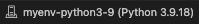

```{r, echo=FALSE}
knitr::opts_chunk$set(error = TRUE)
knitr::opts_knit$set(root.dir = '/Users/helenschmidt/Library/CloudStorage/GoogleDrive-helenschmidt129@gmail.com/My Drive/SANLab/Presentations/2025.01-COG-Python/')
```

# Introduction

This workshop provides an introduction to the Python programming language. Python is a popular language that many researchers, data scientists, and engineers use to organize data, visualize results, and conduct statistical and computational analyses. 

By the end of this workshop, we hope that you will feel comfortable working independently in Python!

*Important Note*: Python uses zero-based indexing, which means the first element in all sequences will start at 0. That means the first row of a data frame will be 0, the second row will be 1, and so on. This can be very important if you're specifying variables or indexing based on location!

# Pre-Workshop: Download Anaconda and VS Code

Before the workshop, you need to download the [Anaconda Navigator](https://www.anaconda.com/products/navigator) and [Visual Studio Code](https://code.visualstudio.com/). You can think of Visual Studio Code (otherwise known as VS Code) as the RStudio equivalent for Python (and many other languages!). Where things start to differ for Python is the need for the Anaconda Navigator. 

Anaconda is an all-in-one app that lets you install, interact with, and run Python packages and code. Within Anaconda, there are multiple Integrated Development Environments, or IDEs, that are specifically designed for writing, editing, and running Python code. You get a code editor, interpreter, and shell all in one place that operates separately from the Python code that some features of your computer run on. An IDE is a really important step to ensuring that your Python code for data analysis doesn't interfere with any Python on your computer. We'll use Anaconda in this workshop to interact with Jupyter Notebook since it's the most similar to R Markdown, but there are many other IDE options. 

The other benefit of the Anaconda Navigator is the ability to set up virtual environments without needing to access your computer's terminal. A virtual environment establishes a space for you to install packages and use a specified version of Python without interfering with Python versions or packages that are needed to run features on your computer. This isolated space allows you to work on all your data projects without bothering your computer system's Python.

**Downloads:**  
1. Download Anaconda Navigator: https://www.anaconda.com/products/navigator  
2. Download VS Code: https://code.visualstudio.com/  
3. Install **Jupyter** within Anaconda Navigator  
4. Download the `intro-to-coding-2025` folder from COG GitHub (https://github.com/TU-Coding-Outreach-Group/intro-to-coding-2025) by pressing the green **Code** button and downloading the ZIP folder. This folder contains all the necessary files for this workshop.

# Create Virtual Environment in Anaconda

Open the Anaconda Navigator and click on Environments.

{width=20%}

Create a new virtual environment by clicking Create on the bottom left.


Add a name for the virtual environment and select Python version 3.9.21. Then click Create!

{width=50%}

# Open VS Code and Launch Virtual Environment

Open VS Code and navigate to left side pane. Click on the extensions button.


Install `Data Wrangler`, `Jupyter`, and `Python` by searching in the search bar and clicking the blue **Install**.  Once they are installed as VS Code extensions, you should see them in the extensions tab. 

{width=30%}

{width=30%}

Now we can create a new Jupyter Notebook and launch the virtual environment. Navigate to File > New File and select Jupyter Notebook. If you don't see Jupyter as an option, close and reopen VS Code. Select Jupyter Notebook to create your Python file.

{width=50%}

In the upper right corner of VS Code, launch your virtual environment by clicking "Select Kernel". Your Anaconda virtual environment should appear as an option to select.


{width=50%}

Once you select your virtual environment, your kernel should now show that selection. You are now able to run Python in VS Code using your Anaconda virtual environment!



```{r, echo=FALSE}
# load reticulate library to include python chunks in markdown
library(reticulate)
# select conda virtual environment
myenv = conda_list()
myenv = myenv$name[2]
use_condaenv(myenv, required = TRUE)
```

# Using Jupyter Notebook

In a typical coding script, every line contains code that the programming language interprets. You can include notes or comments using a # in front of any code. The script will ignore any line or piece of code starting with a #. 

Jupyter Notebooks make things even cleaner for you by splitting up the script into "coding chunks". This allows you to run just a few lines of code at a time, rather than run the entire script in one go. 

We can also include more detailed text than just comments by including "markdown chunks". We can use these to create headers, write explanations, etc. without having to worry about the script interpreting these as code. You'll notice that any coding chunk is tagged with "Python" in the bottom right and any markdown chunk is tagged with "markdown" to help you keep track. You can hover your mouse below any coding or markdown chunk or any output to create a new chunk. 


We can also look at the variables and data we have associated with this script by clicking "Jupyter Variables" in the upper part of VS Code. This opens a data viewer on the bottom of the VS code window to help us keep track of variables and data frames as we edit and change them. 

{width=80%}

Let's get a bit comfortable with our first coding chunk. In this simple example, we create a variable called `x` and set it equal to 1. We then add 2 to `x` which gives us a value of 3. To run the code chunk, we click the arrow to the left of the code chunk and the value 3 is printed. We can also see that our variable `x` is now saved in our Jupyter Variables, where we can see the name (`x`), type (integer), size, and value (1). 

```{python}
x = 1
x + 2
```

{width=50%}

## File Paths

When working with data saved on your computer, you'll likely run into needing to define a "file path". This is just a fancy way to refer to the folders and subfolders that exist on someone's computer. Understanding how to navigate these paths and specify them within a coding script is really important. 

Here's an example of a file path: `"/Users/Helen/Documents/GitHub/intro-to-coding-2025"`  

Each `/` of the file path is a separate folder that we are telling the computer to traverse through. We'll revisit the concept of file paths once we need to find the data we'll be working with in this workshop. 

# Install Libraries

Now that we have VS Code set up, we can get started with scripting! The first thing we need to do is install some specialized Python libraries. They are groups of files that contain convenient short-cuts or functions someone else already programmed to save us some work. Somebody else already figured out a very quick way to compute a function so now we don’t have to! We just use their tools to do it. You may hear people refer to libraries as packages sometimes, but these are the same thing!

Importantly, we are installing these libraries into our virtual environment, NOT our computer's Python files.

To install a new library, simply write `! pip install` followed by the name of the library. We'll be using the following libraries today.

```{python, eval=FALSE}
! pip install numpy
! pip install pandas
! pip install matplotlib
```

Now that we have installed a library, we actually have to load it in to be able to use it. We need to tell Python that we want access to the functions this library has to offer by calling it with `import`. A lot of Python libraries have common shorthand names (e.g., `numpy` as `np`, `pandas` as `pd`) that make it quicker to call them, so we will tell Python the name we want to use as shorthand when importing. 

```{python}
import numpy as np
import pandas as pd
import matplotlib.pyplot as plt
```

# Palmer Penguins Data 

For today's workshop, we'll be working with the `palmerpenguins` dataset. Please make sure you have `palmer-penguins.csv` already downloaded! The data set contains size measurements for 344 penguins observed across three islands in the Palmer Archipelago in Antarctica. 

**References**
palmerpenguins data originally published in:

Gorman KB, Williams TD, Fraser WR (2014). Ecological sexual dimorphism and environmental variability within a community of Antarctic penguins (genus Pygoscelis). PLoS ONE 9(3):e90081. https://doi.org/10.1371/journal.pone.0090081

{width=30%}
{width=50%}

# Load Data

We'll use the `read_csv` function from `pandas` to load the data into Python. We want to save the data as an object, so we'll call it `df` (aka data frame). To call the `read_csv` function from `pandas` we need to first specify the library the function is in (`pd`) and then the function name (`read_csv`) with a `.` between them. We then use the `=` to save the results from the function into an object called `df`.

A data frame can be thought of like a spreadsheet in Excel. It contains many cells organized into columns (variables) and rows (observations). Much like the tidy approach to data wrangling, we generally want each row to represent one observation.

```{python, echo=FALSE}
df = pd.read_csv("/Users/helenschmidt/Library/CloudStorage/GoogleDrive-helenschmidt129@gmail.com/My Drive/SANLab/Presentations/2025.01-COG-Python/palmer-penguins.csv")
```

```{python, eval=FALSE}
df = pd.read_csv('palmer_penguins.csv')
```

Well hang on, this assumes the data set is in the same folder as the script, which isn't often the case! We can add the file path to the data in front of the file name to specify exactly where this data is saved on our computer.

```{python, eval=FALSE}
df = pd.read_csv('/Users/Helen/Documents/GitHub/intro-to-coding-2025/palmer_penguins.csv')
```

{width=50%}

# Viewing Data

We can further view the data using the Data Wrangler extension we installed earlier by clicking on the square arrow to the left of "df". 

{width=50%}

Now that we can see the penguins dataset, let's get a better idea of what each column represents:

**sample_number** columns -- Represents the continuous numbering sequence for each sample where data was collected

**species** column -- The three types of penguin species

**island** column -- The three types of island

**bill_length_mm** column -- A continuous number denoting bill length in millimeters

**bill_depth_mm** column -- An integer denoting bill depth in millimeters

**flipper_length_mm** column -- An integer denoting flipper length in millimeters

**body_mass_g** column -- A continuous number denoting body mass in grams

**sex** column -- Sex of the penguin

**year** column -- Year when the study took place

There are also multiple ways to preview the data within the script, which can often be faster than viewing the entire data frame every time you add a new line of code.

```{python}
# preview first five rows
df.head()
```

```{python}
# preview last five rows
df.tail()
```

```{python}
# print data
print(df)
```

```{python}
# get information about the data (spoiler: notice the non-null count differences)
df.info()
```

In Python, there are many data types. Our `species`, `island`, and `sex` variables are `objects`, which you can think of as text variables. The penguin measurement and weight variables are `float64` which is a `numpy` data type for precise numbers (think accurate decimal points). The `year` variable is an `int64` which is an integer data type also from `numpy`.

```{python}
# summary of variables
df.describe()
```

# Subsetting Data & Variables

What if we only want to work with one variable or column in a given data frame? That's where subsetting comes in! Using the variable names, we can select just one variable from our data frame.

We can use the `[]` after the data frame name `df` with the variable name we want to subset in single quotes.

```{python}
df['species']
```
We can include any of our preview variables after the brackets to show just a few rows too.

```{python}
df['species'].head()
```

We can also include more than one variable by including another set of brackets and listing the variable names separated by commas.

```{python}
df[['species', 'year']].head()
```

We can save these variable subsets as new data frames using the `=`. Then we can ensure the new data frame was created by previewing the first 10 rows.

```{python}
df_subset = df[['species', 'year']]
df_subset.head(10)
```

We can also do what's called a conditional subset, where we select only rows (observations) from a specified variable when another variable contains a certain value. Here, we'll only include observations from penguins on the Biscoe island and include all variables. 

```{python}
# select only data when island is Biscoe
df_subset = df[df['island'] == 'Biscoe']
df_subset.head(10)
```

Sometimes, we may want to use subsetting to get snapshots of unique values in a dataset. We can combine our subsetting syntax with the `drop_duplicates()` function to get just unique observations of penguin species, islands, and years. 

```{python}
# get a data frame of unique species, islands, and years
df_subset = df[['species','island','year']].drop_duplicates()
df_subset.head()
```

Alternatively, we can select only rows with these unique island, species, and year values. Notice the difference in output when switching the location of `drop_duplicates()`. 

```{python}
# get a data frame of unique species, islands, and years
df_subset = df.drop_duplicates(subset = ['species','island','year'])
df_subset.head()
```

Finally, we can create new variables by combining existing variables or specifying new values. Here, we'll create a composite variable that combines bill length (mm) and flipper length (mm). Because of the nature of `pandas` this code will be applied to each row in the data frame individually.

```{python}
# create new composite variable combining bill length and flipper length
df['bill_flipper_mm'] = df['bill_length_mm'] + df['flipper_length_mm']
df.head()
```

# Missing Data

Now you may have noticed the `NaN` in our new `bill_flipper_mm` variable. Based on the preview, we can see that it's in the fourth row of the data frame, but let's get Python to tell us where it is instead. Remember that Python using zero-based indexing!

```{python}
# we have some NaNs in new bill_flipper_mm variable
df_subset = df['bill_flipper_mm']
print(df_subset)
```

We can use the `isna()` function on `df_subset` and ask for the index (row number) of any missing values. In Python, you may encounter missing values that are coded as `NaN`, `None` or `NULL`. Missing values can be represented differently depending on the library you're working in, but for `pandas` you'll most often encounter `NaN`, especially if you're working with a data set that previously existed in R (which is true for the palmer penguins data!). 

`df_subset.isna()` asks Python to find missing values within `df_subset` and `df_subset[].index` asks Python to tell us the index (row number) of some element of the data. By placing the first command within the square brackets, we tell Python to give us the index of missing values.

```{python}
df_subset[df_subset.isna()].index
```

Aha! It turns out we not only have a missing value at index 3 (row number 4, because Python starts rows at 0!), but we also have have one at index 271 (row number 272). We know this is the case for our `bill_flipper_mm` variable, but let's also see if other variables are missing data at these row indices. We can do this using the `iloc()` function and specifying the 3 and 271 indices. 

This returns a true/false (boolean) output where `True` means the value at that index for that variable is missing.

```{python}
df.iloc[[3,271]].isna()
```

We have missing data in `bill_length_mm` and `sex` too! We should check the entire data frame for other missing data too.

Now instead of using `df_subset[df_subset.isna()].index`, we can specify checking the entire data frame `df`. We also want to tell Python to give us the index of any missing value, so we need to include `any()`. Finally, we'll save this as a new object called `missing_indices`.

```{python}
missing_indices = df[df.isna().any(axis=1)].index
# print
missing_indices
```

Wow! Let's see what variables these missing data are in. We can use `iloc()` again.

```{python}
df.iloc[missing_indices].isna()
```

Now that we know missing data exists in the data frame, let's save a subset that only includes rows where no variable has a missing value. We can use the `missing_indices` we already identified and leverage a new function called `drop()` to drop rows that match the missing value indices.

```{python}
df_no_na = df.drop(index=missing_indices)
```

And next time, we can use a function to identify and remove rows with missing values all in one step!

```{python}
df_no_na = df.dropna()
```

Now let's check our new data frame using `info()` and we should see that all non-null values are equal!

```{python}
df_no_na.info()
```
